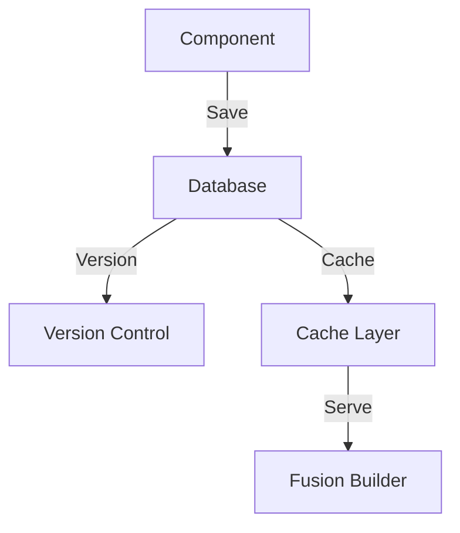
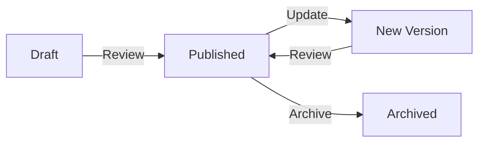

# Component System Architecture

## Overview

The component system is the core of the UHSDS, providing a robust framework for creating, managing, and rendering design system components.

## Architecture Components

### 1. Component Registry

```php
interface ComponentRegistry {
    public function register(Component $component): void;
    public function get(string $id): ?Component;
    public function list(): array;
    public function deregister(string $id): void;
}
```

### 2. Storage Layer



### 3. Component Lifecycle



## Component Structure

### 1. Base Component

```php
abstract class BaseComponent {
    protected $id;
    protected $name;
    protected $version;
    protected $content;
    protected $metadata;
    protected $state;

    abstract public function render(): string;
    abstract public function validate(): bool;
}
```

### 2. Component Types

1. **Standard Components**

   - Basic UI elements
   - Layout components
   - Typography components

2. **Composite Components**

   - Component groups
   - Layout systems
   - Pattern libraries

3. **Dynamic Components**
   - Data-driven components
   - Integration components
   - State-managed components

## Development Interfaces

### 1. Browser IDE

- Real-time editing
- Live preview
- Token integration
- Code validation

### 2. API Interface

```php
interface ComponentAPI {
    public function create(array $data): Component;
    public function update(string $id, array $data): Component;
    public function delete(string $id): bool;
    public function publish(string $id): bool;
}
```

## Integration Points

### 1. Fusion Builder Integration

```php
class FusionBuilderBridge {
    public function registerComponent(Component $component): void;
    public function updateElement(string $id): void;
    public function removeElement(string $id): void;
}
```

### 2. WordPress Integration

```php
class WordPressIntegration {
    public function registerPostType(): void;
    public function registerTaxonomies(): void;
    public function setupCapabilities(): void;
}
```

## Security Considerations

### 1. Input Validation

```php
interface ComponentValidator {
    public function validateStructure(array $data): bool;
    public function sanitizeContent(string $content): string;
    public function validatePermissions(WP_User $user): bool;
}
```

### 2. Output Sanitization

```php
class OutputSanitizer {
    public function sanitizeHTML(string $html): string;
    public function sanitizeCSS(string $css): string;
    public function sanitizeJS(string $js): string;
}
```

## Performance Optimization

### 1. Caching Strategy

```php
interface ComponentCache {
    public function get(string $key): ?string;
    public function set(string $key, string $value, int $ttl = 3600): void;
    public function invalidate(string $key): void;
}
```

### 2. Resource Management

```php
class ResourceManager {
    public function enqueueAssets(Component $component): void;
    public function deferLoading(string $type): void;
    public function optimizeDelivery(): void;
}
```

## Testing Framework

### 1. Unit Tests

```php
class ComponentTest extends WP_UnitTestCase {
    public function testComponentCreation(): void;
    public function testComponentValidation(): void;
    public function testComponentRendering(): void;
}
```

### 2. Integration Tests

```php
class ComponentIntegrationTest extends WP_Test_Case {
    public function testFusionBuilderIntegration(): void;
    public function testWordPressIntegration(): void;
    public function testCacheIntegration(): void;
}
```

## Error Handling

### 1. Error Types

```php
enum ComponentError {
    case VALIDATION_ERROR;
    case PERMISSION_ERROR;
    case RENDERING_ERROR;
    case INTEGRATION_ERROR;
}
```

### 2. Error Management

```php
class ErrorHandler {
    public function handle(ComponentError $error): void;
    public function log(string $message, string $level): void;
    public function notify(string $message): void;
}
```

## Monitoring and Maintenance

### 1. Health Checks

```php
interface HealthCheck {
    public function checkComponentHealth(): HealthStatus;
    public function validateIntegrations(): HealthStatus;
    public function monitorPerformance(): HealthStatus;
}
```

### 2. Maintenance Tasks

```php
class MaintenanceManager {
    public function cleanupOldVersions(): void;
    public function optimizeDatabase(): void;
    public function validateComponents(): void;
}
```

## Future Extensibility

### 1. Plugin System

```php
interface ComponentPlugin {
    public function register(): void;
    public function initialize(): void;
    public function terminate(): void;
}
```

### 2. Custom Providers

```php
interface CustomProvider {
    public function provide(): mixed;
    public function configure(array $config): void;
    public function validate(): bool;
}
```

---

## Component Development Agent Review Notes ("The Craftsperson")

### Immediate Concerns

1. **Component Composition System**

   - Need clear inheritance patterns for components
   - Missing slot/fragment system for component composition
   - Require better state management between nested components

2. **Template System Enhancement**

   ```php
   interface TemplateSystem {
       public function registerTemplate(string $name, array $slots): void;
       public function extendTemplate(string $base, array $overrides): void;
       public function renderTemplate(string $name, array $data): string;
   }
   ```

3. **IDE Integration**
   - Browser IDE needs component scaffolding
   - Real-time preview requires better error boundaries
   - Component testing environment in IDE

### Development Workflow

1. **Component Creation Pipeline**

   ```mermaid
   graph TD
       A[Design Import] -->|Parse| B[Component Scaffold]
       B -->|Develop| C[Local Testing]
       C -->|Validate| D[Integration Testing]
       D -->|Review| E[Component Registry]
       E -->|Deploy| F[Production]
   ```

2. **Development Tools**
   ```yaml
   tools:
     scaffolding:
       - component_templates
       - test_templates
       - documentation_templates
     testing:
       - unit_test_framework
       - visual_regression
       - accessibility_checks
     debugging:
       - state_inspector
       - performance_profiler
       - token_validator
   ```

### Code Quality

1. **Component Standards**

   - Implement strict typing throughout
   - Add PHPStan/Psalm static analysis
   - Enforce PSR-12 coding standards

2. **Testing Requirements**
   - Add visual regression testing
   - Implement accessibility testing
   - Add performance benchmarking

### Integration Concerns

1. **Timber Integration**

   - Better template inheritance system
   - Twig function/filter extensions
   - Component-specific Twig namespace

2. **Fusion Builder**
   - Enhanced preview system
   - Better dynamic content handling
   - Improved drag-and-drop interface

### Performance Optimizations

1. **Asset Management**

   ```php
   interface AssetOptimizer {
       public function bundleAssets(array $components): void;
       public function optimizeImages(): void;
       public function deferNonCritical(): void;
   }
   ```

2. **State Management**
   ```php
   interface StateManager {
       public function observe(string $key): Observable;
       public function dispatch(string $action, $payload): void;
       public function getSnapshot(): array;
   }
   ```

### Documentation Requirements

1. **Component Documentation**

   - Interactive examples needed
   - Property type documentation
   - State management guide

2. **Development Guides**
   - Component creation workflow
   - Testing best practices
   - Performance optimization guide

### Next Actions

1. Create component development toolkit
2. Implement component scaffolding system
3. Enhance testing infrastructure
4. Develop IDE plugins for component development
