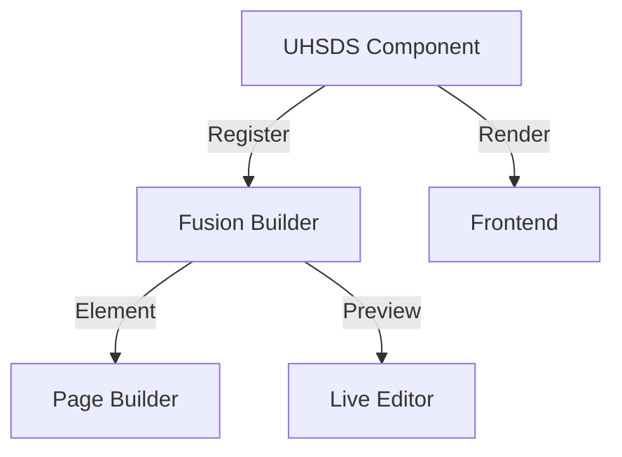
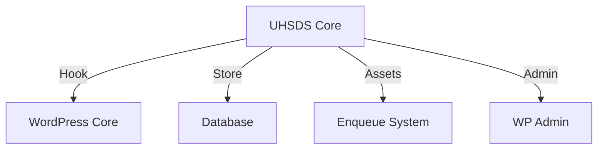
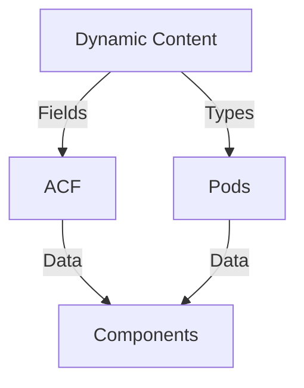

# Integration Architecture

## Overview

The UHSDS integration architecture defines how the system interfaces with external systems and provides extension points for additional functionality.

## Core Integrations

### 1. Fusion Builder Integration



### 2. WordPress Integration



### 3. ACF/Pods Integration



## Browser IDE Integration

### 1. Editor Architecture

```typescript
interface IDEArchitecture {
  core: {
    editor: MonacoEditor;
    preview: PreviewEngine;
    storage: StorageManager;
  };

  extensions: {
    tokenProvider: TokenProvider;
    completionProvider: CompletionProvider;
    validationProvider: ValidationProvider;
  };
}
```

### 2. Preview System

```typescript
class PreviewEngine {
  private frame: HTMLIFrameElement;
  private context: PreviewContext;

  constructor() {
    this.setupPreviewFrame();
    this.initializeContext();
  }

  public updatePreview(content: ComponentContent): void {
    this.validateContent(content);
    this.renderPreview(content);
  }
}
```

## Extension Points

### 1. Plugin System

```php
interface UHSDSPlugin {
    public function register(): void;
    public function initialize(): void;
    public function getCapabilities(): array;
}

class PluginRegistry {
    private $plugins = [];

    public function registerPlugin(UHSDSPlugin $plugin): void {
        $this->plugins[] = $plugin;
        $plugin->register();
    }
}
```

### 2. Hook System

```php
class HookManager {
    public function addFilter(string $name, callable $callback): void;
    public function addAction(string $name, callable $callback): void;
    public function removeFilter(string $name): void;
    public function removeAction(string $name): void;
}
```

## Data Flow

### 1. Component Registration

```php
interface ComponentRegistration {
    public function registerWithFusion(): void;
    public function registerWithWordPress(): void;
    public function registerWithACF(): void;
}

class RegistrationManager implements ComponentRegistration {
    private $fusionBridge;
    private $wordPressBridge;
    private $acfBridge;

    public function registerWithFusion(): void {
        // Registration logic
    }
}
```

### 2. Data Synchronization

```php
interface DataSync {
    public function syncWithDatabase(): void;
    public function syncWithCache(): void;
    public function validateSync(): bool;
}

class SyncManager implements DataSync {
    private $dbConnection;
    private $cacheManager;

    public function syncWithDatabase(): void {
        // Sync logic
    }
}
```

## Security

### 1. Authentication

```php
interface AuthProvider {
    public function authenticate(string $token): bool;
    public function validatePermissions(string $action): bool;
    public function generateToken(): string;
}

class SecurityManager implements AuthProvider {
    private $wpAuth;

    public function authenticate(string $token): bool {
        // Auth logic
    }
}
```

### 2. Data Protection

```php
interface DataProtection {
    public function encrypt(string $data): string;
    public function decrypt(string $data): string;
    public function validate(string $data): bool;
}

class ProtectionManager implements DataProtection {
    private $encryptionKey;

    public function encrypt(string $data): string {
        // Encryption logic
    }
}
```

## Performance

### 1. Caching Strategy

```php
interface CacheStrategy {
    public function get(string $key): mixed;
    public function set(string $key, mixed $value): void;
    public function invalidate(string $key): void;
}

class CacheManager implements CacheStrategy {
    private $cache;

    public function get(string $key): mixed {
        // Cache retrieval logic
    }
}
```

### 2. Asset Management

```php
interface AssetManager {
    public function enqueue(): void;
    public function dequeue(): void;
    public function optimize(): void;
}

class IntegrationAssets implements AssetManager {
    private $dependencies = [];

    public function enqueue(): void {
        // Asset enqueueing logic
    }
}
```

## Error Handling

### 1. Error Management

```php
interface ErrorHandler {
    public function handle(Throwable $error): void;
    public function log(string $message): void;
    public function notify(string $message): void;
}

class IntegrationErrorHandler implements ErrorHandler {
    private $logger;

    public function handle(Throwable $error): void {
        // Error handling logic
    }
}
```

### 2. Recovery Strategies

```php
interface RecoveryStrategy {
    public function backup(): void;
    public function restore(): void;
    public function validate(): bool;
}

class RecoveryManager implements RecoveryStrategy {
    private $backupManager;

    public function backup(): void {
        // Backup logic
    }
}
```

## Monitoring

### 1. Health Checks

```php
interface HealthCheck {
    public function checkIntegrations(): HealthStatus;
    public function validateConnections(): bool;
    public function reportStatus(): array;
}

class IntegrationHealth implements HealthCheck {
    private $monitors = [];

    public function checkIntegrations(): HealthStatus {
        // Health check logic
    }
}
```

### 2. Performance Monitoring

```php
interface PerformanceMonitor {
    public function measure(string $operation): void;
    public function report(): array;
    public function alert(string $threshold): void;
}

class IntegrationPerformance implements PerformanceMonitor {
    private $metrics = [];

    public function measure(string $operation): void {
        // Performance measurement logic
    }
}
```

---

## System Integration Agent Review Notes ("The Integrator")

### Critical Integration Points

1. **WordPress Core Integration**

   - Need better handling of custom post type registration
   - Missing multisite support considerations
   - Require clearer plugin activation/deactivation hooks

2. **Event System Enhancement**

   ```php
   interface EventSystem {
       public function subscribe(string $event, callable $handler): void;
       public function publish(string $event, array $data): void;
       public function unsubscribe(string $event, callable $handler): void;
   }
   ```

3. **Integration Bridge Pattern**
   ```mermaid
   graph TD
       A[UHSDS Core] -->|Bridge| B[Integration Layer]
       B -->|Adapter| C[WordPress]
       B -->|Adapter| D[Fusion Builder]
       B -->|Adapter| E[ACF/Pods]
       B -->|Adapter| F[External Systems]
   ```

### System Boundaries

1. **Data Flow Control**

   ```yaml
   boundaries:
     wordpress:
       - post_type_registration
       - taxonomy_management
       - capability_handling
     fusion_builder:
       - element_registration
       - preview_system
       - builder_interface
     acf_pods:
       - field_registration
       - data_synchronization
       - type_management
   ```

2. **API Contracts**
   - Need versioned API interfaces
   - Better error handling across boundaries
   - Standardized response formats

### Performance Concerns

1. **Integration Caching**

   ```php
   interface IntegrationCache {
       public function cacheIntegrationData(string $key, $data): void;
       public function invalidateIntegrationCache(string $pattern): void;
       public function warmupIntegrationCache(): void;
   }
   ```

2. **Resource Management**
   - Implement connection pooling
   - Add request rate limiting
   - Better asset loading coordination

### Security Considerations

1. **Cross-System Authentication**

   - Implement OAuth2 flow
   - Add JWT token support
   - Better role synchronization

2. **Data Validation**
   ```php
   interface CrossSystemValidator {
       public function validateDataFlow(array $data): ValidationResult;
       public function sanitizeAcrossContexts(mixed $data): mixed;
       public function verifyIntegrity(string $checksum): bool;
   }
   ```

### Monitoring Requirements

1. **Integration Health**

   - Add system status dashboard
   - Implement integration heartbeats
   - Better error reporting

2. **Performance Metrics**
   ```php
   interface IntegrationMetrics {
       public function trackLatency(string $integration): void;
       public function measureThroughput(): array;
       public function reportBottlenecks(): array;
   }
   ```

### Documentation Needs

1. **Integration Guides**

   - System boundary documentation
   - Integration setup workflows
   - Troubleshooting guides

2. **API Documentation**
   - OpenAPI specifications
   - Integration examples
   - Error code reference

### Next Steps

1. Implement integration monitoring system
2. Develop cross-system authentication
3. Create integration testing suite
4. Build integration dashboard
