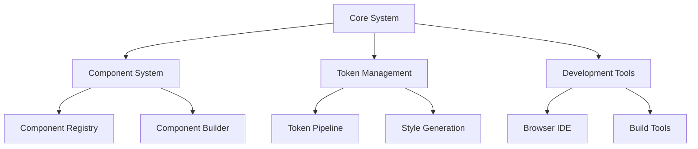
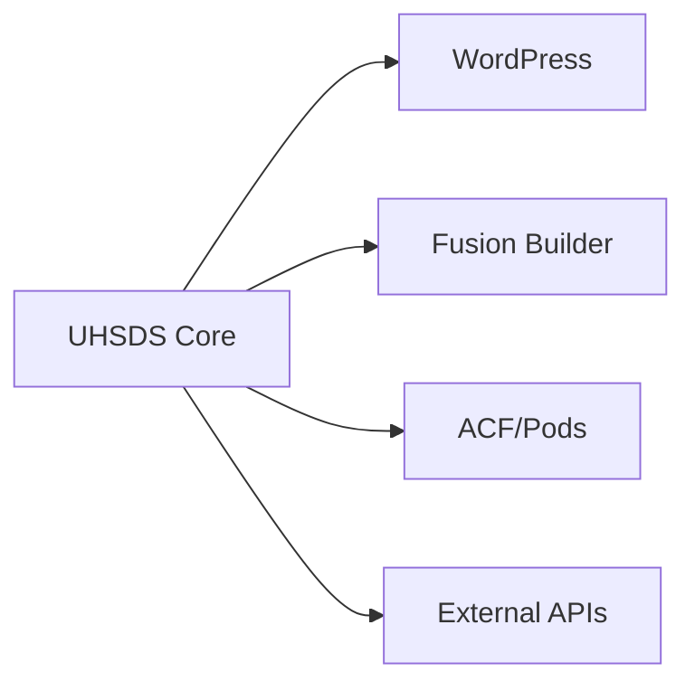
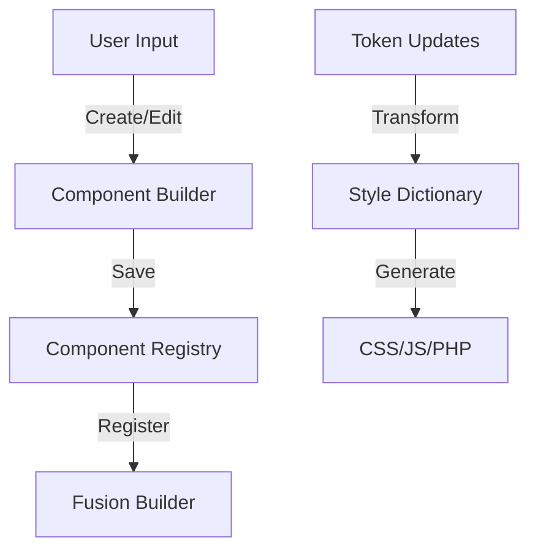

# Architecture Overview

## System Design Philosophy

The UHSDS (UH Style Design System) is built on principles of modularity, extensibility, and maintainability. This document provides a high-level overview of the system architecture and its key components.

## Core Architectural Principles

1. **Separation of Concerns**

   - Component management
   - Design token system
   - Development tools
   - Integration interfaces

2. **Extensibility First**

   - Plugin architecture
   - Integration points
   - Custom providers
   - Hook system

3. **Performance by Design**
   - Caching strategies
   - Asset optimization
   - Lazy loading
   - Resource management

## System Components



## Key Subsystems

### 1. Component System

- Component registry
- Version control
- State management
- Preview system

### 2. Token Management

- Token definition
- Transform pipeline
- Platform outputs
- Sync mechanism

### 3. Development Tools

- Browser IDE
- Build system
- Testing framework
- Documentation

### 4. Integration Layer

- Fusion Builder
- ACF/Pods
- WordPress core
- External systems

## Documentation Structure

```
docs/
├── architecture/          # System architecture documentation
│   ├── overview.md       # This file
│   ├── components.md     # Component system architecture
│   ├── tokens.md        # Token system architecture
│   └── integrations.md  # Integration architecture
├── guides/              # Implementation guides
│   ├── development.md   # Development guide
│   ├── deployment.md    # Deployment guide
│   └── maintenance.md   # Maintenance guide
├── roadmap/             # Project planning
│   ├── current.md       # Current version features
│   ├── upcoming.md      # Planned features
│   └── backlog.md       # Future considerations
└── technical/           # Technical specifications
    ├── api/             # API documentation
    ├── workflows/       # Process documentation
    └── standards/       # Coding standards
```

## System Boundaries

### 1. External Interfaces



### 2. Data Flow



## Security Model

1. **Authentication**

   - WordPress roles
   - Custom capabilities
   - API authentication

2. **Authorization**

   - Component access
   - Token management
   - System configuration

3. **Data Protection**
   - Input validation
   - Output sanitization
   - Content security

## Performance Considerations

1. **Caching Strategy**

   - Component caching
   - Token caching
   - Preview caching

2. **Asset Management**

   - Resource bundling
   - Code splitting
   - Lazy loading

3. **Database Optimization**
   - Query optimization
   - Index strategy
   - Data structure

## Scalability

1. **Horizontal Scaling**

   - Stateless components
   - Distributed caching
   - Load balancing

2. **Vertical Scaling**
   - Resource optimization
   - Memory management
   - Process isolation

## Monitoring and Maintenance

1. **Health Checks**

   - System status
   - Performance metrics
   - Error tracking

2. **Backup Strategy**

   - Component backups
   - Token backups
   - System state

3. **Update Management**
   - Version control
   - Migration paths
   - Rollback procedures

## Future Considerations

1. **Extensibility**

   - Plugin system
   - Custom providers
   - Integration APIs

2. **Internationalization**

   - Multi-language support
   - RTL support
   - Cultural considerations

3. **Accessibility**
   - WCAG compliance
   - Keyboard navigation
   - Screen reader support

---

## Design Token Agent Review Notes ("The Architect")

### Critical Concerns

1. **Token Pipeline Specification**

   - Current diagram oversimplifies token transformation process
   - Need explicit validation steps between Transform and Generate
   - Missing token versioning and conflict resolution strategy

2. **Style Dictionary Integration**

   ```mermaid
   graph TD
       A[Raw Tokens] -->|Validate| B[Parse]
       B -->|Transform| C[Style Dictionary]
       C -->|Platform| D[CSS]
       C -->|Platform| E[JS]
       C -->|Platform| F[PHP]
       D --> G[Validation]
       E --> G
       F --> G
   ```

3. **Token Security**
   - Token management permissions need granular control
   - Missing token audit trail system
   - Need specification for token backup/restore

### Recommendations

1. **Token Architecture Enhancement**

   ```yaml
   token_system:
     validation:
       - structural
       - semantic
       - reference
     versioning:
       strategy: "semantic"
       conflict_resolution: "manual"
     monitoring:
       - usage_tracking
       - performance_impact
       - deprecation_warnings
   ```

2. **Integration Requirements**

   - Define token subscription system for components
   - Implement token hot-reload mechanism
   - Add token usage analytics

3. **Performance Considerations**
   - Token compilation optimization strategy
   - Selective token loading system
   - Token caching hierarchy

### Standards Compliance

1. **W3C Compatibility**

   - Ensure CSS custom property naming conventions
   - Implement fallback values systematically
   - Add CSS Houdini integration plan

2. **Accessibility Requirements**
   - Color contrast token validation
   - Motion reduction token support
   - High contrast mode token sets

### Documentation Needs

1. **Token System**

   - Detailed token transformation pipeline
   - Token naming convention guidelines
   - Token validation rules

2. **Integration Guides**
   - Style Dictionary configuration
   - Custom transformation creation
   - Token usage patterns

### Next Steps

1. Create detailed token architecture document
2. Define token validation ruleset
3. Establish token versioning strategy
4. Develop token monitoring system
