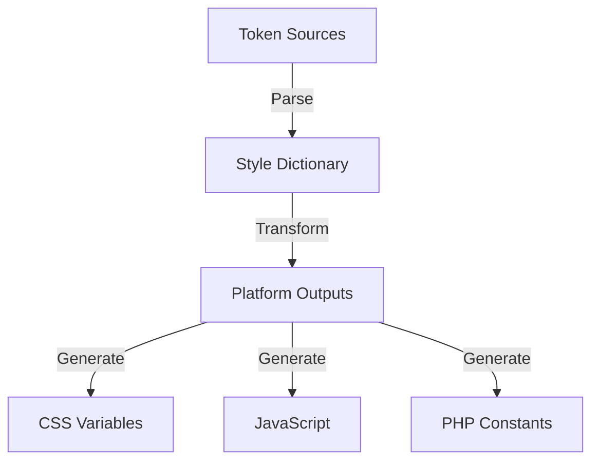
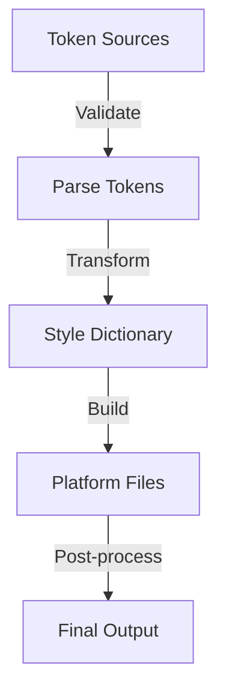

# Token System Architecture

## Overview

The token system manages design tokens through Style Dictionary, providing a single source of truth for design values across the entire system.

## Core Components

### 1. Token Definition

```json
{
  "color": {
    "brand": {
      "primary": { "value": "#0066CC" },
      "secondary": { "value": "#FF4400" }
    },
    "semantic": {
      "success": { "value": "{color.brand.primary}" },
      "error": { "value": "#FF0000" }
    }
  },
  "spacing": {
    "scale": {
      "base": { "value": "8px" },
      "small": { "value": "4px" },
      "medium": { "value": "16px" },
      "large": { "value": "32px" }
    }
  }
}
```

### 2. Token Pipeline



## Token Categories

### 1. Design Tokens

- Colors
- Typography
- Spacing
- Breakpoints
- Shadows
- Animations

### 2. Semantic Tokens

- Brand colors
- UI states
- Component-specific
- Theme variations

### 3. Component Tokens

- Component-specific values
- State variations
- Theme overrides

## Token Management

### 1. Token Service

```php
interface TokenService {
    public function getToken(string $path): mixed;
    public function setToken(string $path, mixed $value): void;
    public function resolveReferences(array $tokens): array;
    public function validateToken(string $path, mixed $value): bool;
}
```

### 2. Token Storage

```php
class TokenStorage {
    public function store(array $tokens): void;
    public function retrieve(string $platform): array;
    public function backup(): string;
    public function restore(string $backup): bool;
}
```

## Platform Integration

### 1. Style Dictionary Configuration

```javascript
module.exports = {
  source: ["tokens/**/*.json"],
  platforms: {
    css: {
      transformGroup: "css",
      buildPath: "build/css/",
      files: [
        {
          destination: "variables.css",
          format: "css/variables",
        },
      ],
    },
    js: {
      transformGroup: "js",
      buildPath: "build/js/",
      files: [
        {
          destination: "tokens.js",
          format: "javascript/module",
        },
      ],
    },
  },
};
```

### 2. WordPress Integration

```php
class WordPressTokenIntegration {
    public function registerSettings(): void;
    public function enqueueTokens(): void;
    public function provideDynamicCSS(): void;
}
```

## Theme Support

### 1. Theme Structure

```typescript
interface ThemeDefinition {
  name: string;
  tokens: TokenOverrides;
  metadata: ThemeMetadata;
}

interface TokenOverrides {
  [key: string]: {
    value: any;
    scope?: string[];
  };
}
```

### 2. Theme Management

```php
class ThemeManager {
    public function registerTheme(string $name, array $tokens): void;
    public function activateTheme(string $name): void;
    public function getActiveTheme(): string;
}
```

## Build System

### 1. Build Pipeline



### 2. Build Configuration

```typescript
interface BuildConfig {
  source: string[];
  platforms: Platform[];
  transforms: Transform[];
  formats: Format[];
}

interface Platform {
  name: string;
  transform: string;
  buildPath: string;
  files: BuildFile[];
}
```

## Version Control

### 1. Token Versioning

```php
class TokenVersion {
    public function createVersion(): string;
    public function compareVersions(string $v1, string $v2): array;
    public function rollback(string $version): bool;
}
```

### 2. Change Management

```php
interface ChangeManager {
    public function trackChanges(array $changes): void;
    public function validateChanges(array $changes): bool;
    public function applyChanges(array $changes): void;
}
```

## Performance Optimization

### 1. Caching Strategy

```php
interface TokenCache {
    public function cacheTokens(array $tokens): void;
    public function getCachedTokens(): ?array;
    public function invalidateCache(): void;
}
```

### 2. Delivery Optimization

```php
class TokenDelivery {
    public function optimizeOutput(array $tokens): array;
    public function minifyOutput(string $output): string;
    public function compressDelivery(string $content): string;
}
```

## Security Considerations

### 1. Access Control

```php
interface TokenSecurity {
    public function validateAccess(WP_User $user, string $action): bool;
    public function sanitizeInput(array $input): array;
    public function validateOutput(array $output): bool;
}
```

### 2. Data Protection

```php
class TokenProtection {
    public function encryptSensitive(array $data): string;
    public function decryptSensitive(string $data): array;
    public function validateIntegrity(array $tokens): bool;
}
```

## Monitoring and Maintenance

### 1. Health Checks

```php
interface TokenHealth {
    public function checkIntegrity(): HealthStatus;
    public function validateReferences(): HealthStatus;
    public function monitorUsage(): UsageStats;
}
```

### 2. Maintenance Tasks

```php
class TokenMaintenance {
    public function cleanupUnused(): void;
    public function optimizeStorage(): void;
    public function validateAll(): ValidationResult;
}
```
