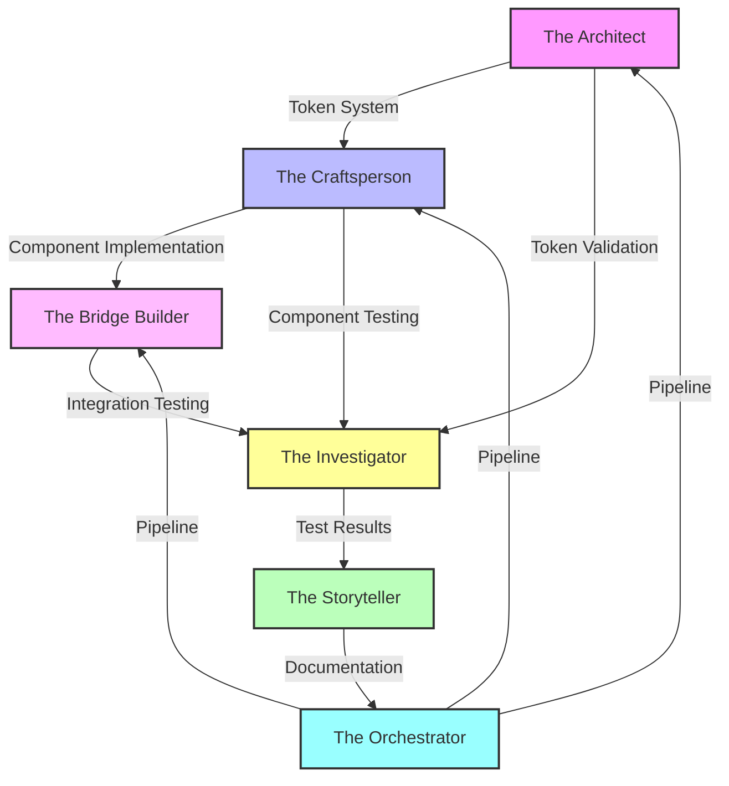
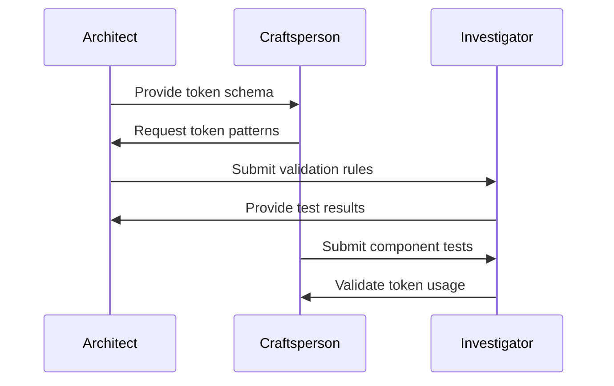
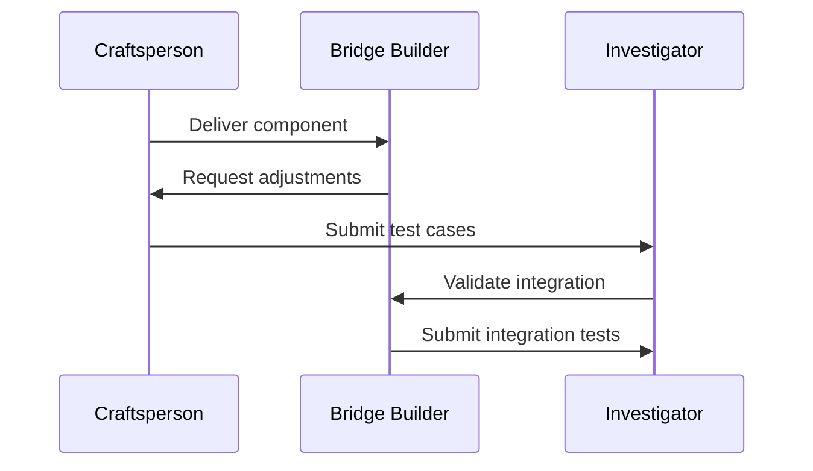
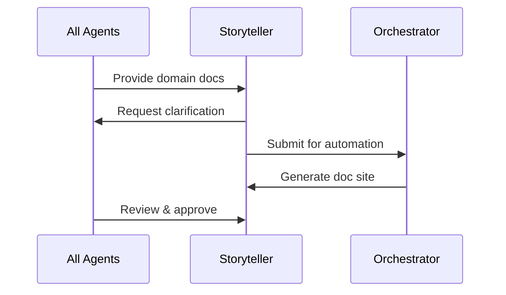

# Agent Collaboration Points

## MVP Phase Integration Map



## Critical Handoff Points

### 1. Architect → Craftsperson

**Token System to Component Implementation**

```yaml
handoff_requirements:
  token_delivery:
    format: "JSON schema with CSS variable mapping"
    validation: "Pre-validated token structure"
    documentation: "Token usage patterns"
  integration_points:
    - Token consumption API
    - Theme integration
    - State management hooks
```

### 2. Craftsperson → Bridge Builder

**Component to Fusion Builder Integration**

```php
interface ComponentIntegration {
    // Provided by Craftsperson
    public function getComponentSchema(): array;
    public function getRenderTemplate(): string;
    public function getStateDefinition(): array;

    // Required by Bridge Builder
    public function registerWithFusion(): void;
    public function handlePreview(): string;
    public function manageState(): void;
}
```

### 3. All Agents → Investigator

**Testing Requirements Matrix**

```yaml
testing_handoff:
  architect:
    - Token validation rules
    - Transform expectations
    - Error scenarios
  craftsperson:
    - Component test cases
    - Accessibility requirements
    - Performance benchmarks
  bridge_builder:
    - Integration test paths
    - Error handling cases
    - Preview requirements
```

### 4. All Agents → Storyteller

**Documentation Requirements**

```markdown
## Documentation Handoff Checklist

### Token System (Architect)

- [ ] Token structure documentation
- [ ] Usage patterns
- [ ] Extension points

### Component System (Craftsperson)

- [ ] Component API documentation
- [ ] Implementation examples
- [ ] Best practices

### Integration (Bridge Builder)

- [ ] Integration setup guide
- [ ] Troubleshooting guide
- [ ] Extension examples
```

### 5. All Agents → Orchestrator

**Pipeline Requirements**

```yaml
pipeline_requirements:
  architect:
    - Token validation steps
    - Transform verification
    - Output validation
  craftsperson:
    - Component build process
    - Asset compilation
    - Style processing
  bridge_builder:
    - Integration validation
    - Preview generation
    - Error checking
```

## Collaborative Workflows

### 1. Token Implementation



### 2. Component Development



### 3. Documentation Flow



## MVP Collaboration Checkpoints

### Week 1: Foundation

```yaml
checkpoints:
  day_1_2:
    architect_craftsperson:
      - Token schema review
      - Component requirements
    craftsperson_bridge:
      - Integration pattern
      - Component structure
  day_3_4:
    all_investigator:
      - Test plan review
      - Coverage requirements
    all_storyteller:
      - Documentation outline
      - Tutorial structure
```

### Week 2: Integration

```yaml
checkpoints:
  day_1_2:
    architect_investigator:
      - Token validation
      - Transform testing
    craftsperson_investigator:
      - Component testing
      - Accessibility checks
  day_3_4:
    bridge_investigator:
      - Integration testing
      - Preview validation
    all_orchestrator:
      - Pipeline review
      - Deployment check
```

## Communication Channels

### Daily Sync Points

```yaml
sync_requirements:
  morning_standup:
    focus: "Handoff coordination"
    duration: "15 minutes"
    participants: "All agents"

  end_of_day:
    focus: "Blocker resolution"
    duration: "15 minutes"
    participants: "Blocked agents"
```

### Documentation Updates

```yaml
documentation_flow:
  process:
    - Agent updates domain docs
    - Storyteller reviews and standardizes
    - Orchestrator automates publishing
    - All agents review final output
```

## Risk Management

### Integration Risks

```yaml
risk_mitigation:
  token_component:
    risk: "Token consumption issues"
    mitigation: "Early integration testing"
    owner: "Architect + Craftsperson"

  component_fusion:
    risk: "Integration compatibility"
    mitigation: "Continuous integration testing"
    owner: "Craftsperson + Bridge Builder"

  system_wide:
    risk: "Cross-system issues"
    mitigation: "Regular integration checkpoints"
    owner: "All agents + Investigator"
```

## Success Criteria

### Integration Success Metrics

```yaml
success_metrics:
  token_system:
    - Clean handoff to components
    - Validated transformation
    - Documented patterns

  component_system:
    - Successful Fusion Builder integration
    - Passing test suite
    - Complete documentation

  overall_system:
    - All integration points tested
    - Documentation complete
    - Pipeline operational
```
