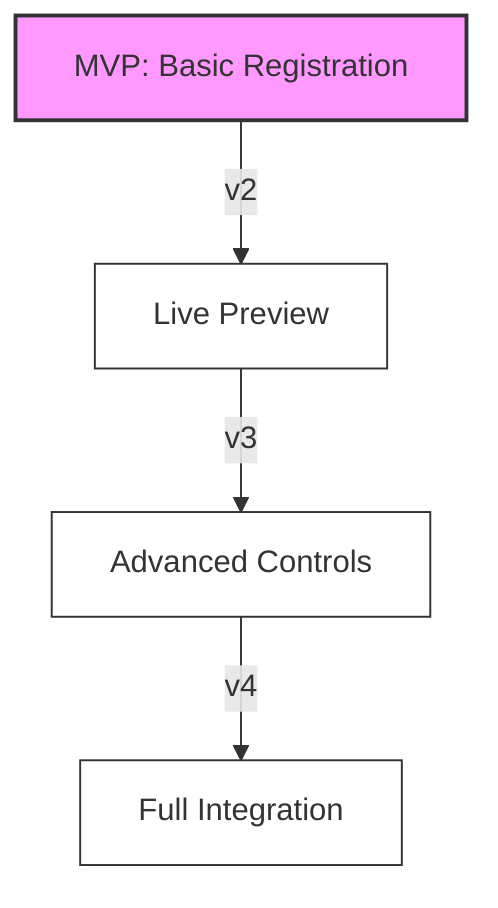

# MVP Milestones Roadmap

## Agent Perspectives on MVP

### The Architect (Design Token Agent)

> "Our token system needs to start with the absolute basics - just colors and typography. I envision a simple JSON-to-CSS pipeline that can grow. No fancy transforms yet, just direct mapping to CSS variables. We'll add semantic relationships later. What's crucial is establishing a clean, extensible structure that won't paint us into a corner. Think of it like laying the foundation of a building - get this right, and we can build anything on top of it."

**Initial Focus**:

```yaml
token_mvp_v1:
  structure:
    - direct_mapping
    - flat_hierarchy
    - basic_categories
  implementation:
    - json_input
    - css_output
    - simple_validation
  growth_path:
    v2: "Add semantic relationships"
    v3: "Implement token transforms"
    v4: "Add complex validation"
```

### The Craftsperson (Component Development Agent)

> "Let's start with just one perfect component - a button. It sounds simple, but it'll force us to solve the core problems: token consumption, state management, and Timber integration. I want this button to be flawless - accessible, performant, and maintainable. Once we nail this pattern, scaling to other components becomes straightforward. It's like crafting a perfect joint in woodworking - master the basic technique, and larger pieces become possible."

**Initial Focus**:

```php
class ButtonComponent extends BaseComponent {
    // MVP Features
    public function render(): string;     // Basic rendering
    public function setState(): void;      // Simple hover/focus
    public function useTokens(): void;     // Basic color/typography

    // Future Iterations
    // v2: Add animation support
    // v3: Add complex state management
    // v4: Add composition system
}
```

### The Bridge Builder (Integration Agent)

> "Integration is where complexity can explode, so let's be strategic. MVP means one solid bridge between our system and Fusion Builder - just enough to prove the concept. I'm thinking a simple element registration that handles our button component perfectly. No fancy previews yet, just reliable rendering. It's like building a suspension bridge - start with a single, strong cable before adding the complexity of the full span."

**Integration Evolution**:



### The Investigator (Testing & QA Agent)

> "Testing needs to be thorough from day one, but let's be smart about scope. I want comprehensive tests for our button component and token pipeline - every edge case, every user interaction. It might seem excessive for MVP, but this creates our testing patterns for everything that follows. Think of it as a detective establishing their investigation methods - get the process right with a small case, and it scales to bigger ones."

**Testing Strategy**:

```yaml
mvp_testing_approach:
  component_testing:
    v1:
      - full_button_coverage
      - accessibility_testing
      - token_integration
    v2:
      - visual_regression
      - performance_metrics
    v3:
      - cross_component_testing
      - system_integration_tests
```

### The Storyteller (Documentation Agent)

> "Documentation isn't an afterthought - it's part of our MVP. I envision a 'living story' that grows with our system. We start with crystal-clear docs for our button component and token system, but structure them to scale. Each doc should answer three questions: 'What is it?', 'How do I use it?', and 'How do I extend it?' It's like writing the first chapter of a book - it needs to stand alone while setting up the larger narrative."

**Documentation Plan**:

```markdown
MVP Documentation Structure:

1. Getting Started

   - Simple button implementation
   - Basic token usage
   - Clear growth path

2. Technical Reference

   - Button API
   - Token structure
   - Integration points

3. Tutorials
   - "Your First Component"
   - "Working with Tokens"
   - "Basic Integration"

Future Chapters:

- Component Composition (v2)
- Advanced Tokens (v3)
- System Patterns (v4)
```

### The Orchestrator (CI/CD Agent)

> "Automation should grow with our system. For MVP, I want a lean but complete pipeline: lint, build, test, deploy. Nothing fancy, but rock-solid reliable. We'll add sophistication in layers - first get the basics automated, then add performance testing, then visual regression, then automated documentation. It's like conducting an orchestra - start with the fundamental rhythm section, then gradually bring in more instruments."

**Pipeline Evolution**:

```yaml
pipeline_stages:
  mvp:
    - basic_validation
    - simple_build
    - core_tests
    - manual_review
  v2:
    - automated_testing
    - performance_checks
  v3:
    - visual_testing
    - integration_tests
  v4:
    - automated_docs
    - system_analytics
```

## Revised Phase 0: Foundation (2 Weeks)

### Week 1: Core Implementation

1. **Token System** (The Architect)

   - Basic JSON-to-CSS pipeline
   - Color and typography tokens only
   - Simple validation system

2. **Component Foundation** (The Craftsperson)

   - Button component implementation
   - Basic Timber integration
   - Token consumption pattern

3. **Integration Basics** (The Bridge Builder)
   - Fusion Builder registration
   - Simple render function
   - Basic error handling

### Week 2: Quality Foundation

1. **Testing Framework** (The Investigator)

   - Button component test suite
   - Token validation tests
   - Integration smoke tests

2. **Documentation Start** (The Storyteller)

   - Getting started guide
   - Button component docs
   - Token usage guide

3. **Pipeline Setup** (The Orchestrator)
   - Basic GitHub Actions
   - Automated testing
   - Simple deployment

## Success Metrics for MVP

### Functionality Metrics

```yaml
mvp_success:
  button_component:
    - Renders correctly
    - Consumes tokens properly
    - Handles basic states
  token_system:
    - Processes basic tokens
    - Generates valid CSS
    - Updates reliably
  integration:
    - Registers with Fusion Builder
    - Renders in frontend
    - Handles errors gracefully
```

### Quality Metrics

```yaml
quality_gates:
  testing:
    - 100% button test coverage
    - All token tests passing
    - Integration tests green
  documentation:
    - All core features documented
    - Tutorial completeness
    - Clear next steps
  automation:
    - Pipeline reliability
    - Build consistency
    - Deploy success rate
```

## Next Iterations Preview

Each agent's vision for immediate next steps:

1. **The Architect**:
   "Add semantic relationships between tokens"

2. **The Craftsperson**:
   "Implement component composition system"

3. **The Bridge Builder**:
   "Add live preview capabilities"

4. **The Investigator**:
   "Implement visual regression testing"

5. **The Storyteller**:
   "Create interactive documentation"

6. **The Orchestrator**:
   "Add automated performance testing"
