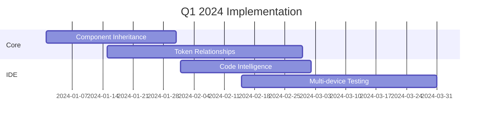
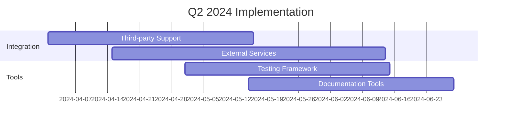

# Upcoming Features

## Version 1.1.0 (Q1 2024)

### Core Enhancements

1. **Component System**

   - Component inheritance system
   - Advanced state management
   - Component composition tools
   - Version control improvements

2. **Token Management**

   - Advanced token relationships
   - Token validation rules
   - Custom token types
   - Token documentation generation

3. **Browser IDE**
   - Enhanced code intelligence
   - Advanced preview features
   - Multi-device testing
   - Collaborative editing

### New Features

1. **AI Integration**

   ```mermaid
   graph TD
       A[Component Request] -->|AI Analysis| B[Code Generation]
       B -->|Review| C[Component Creation]
       C -->|Validate| D[Integration]
       D -->|Deploy| E[Production]
   ```

   - Component suggestions
   - Code optimization
   - Documentation generation
   - Accessibility checks

2. **Advanced Theming**

   ```mermaid
   graph LR
       A[Theme Editor] -->|Create| B[Theme Tokens]
       B -->|Generate| C[Preview]
       C -->|Test| D[Validation]
       D -->|Deploy| E[Production]
   ```

   - Visual theme editor
   - Theme inheritance
   - Advanced customization
   - Theme testing tools

3. **Performance Tools**
   ```mermaid
   graph TD
       A[Performance Monitor] -->|Analyze| B[Metrics]
       B -->|Identify| C[Issues]
       C -->|Suggest| D[Optimizations]
       D -->|Apply| E[Improvements]
   ```
   - Performance monitoring
   - Optimization suggestions
   - Resource analysis
   - Load time improvements

## Version 1.2.0 (Q2 2024)

### Integration Enhancements

1. **Third-Party Plugins**

   - Enhanced ACF integration
   - Advanced Pods support
   - Custom field builders
   - Integration framework

2. **External Services**
   - Design system sync
   - Cloud storage
   - CDN integration
   - API management

### Development Tools

1. **Testing Framework**

   - Automated testing
   - Visual regression
   - Performance testing
   - Accessibility testing

2. **Documentation Tools**
   - Auto-documentation
   - Interactive examples
   - Code playgrounds
   - Version tracking

## Version 1.3.0 (Q3 2024)

### Advanced Features

1. **Component Analytics**

   ```json
   {
     "analytics": {
       "usage": {
         "tracking": true,
         "metrics": ["views", "interactions", "errors"],
         "reporting": "weekly"
       },
       "performance": {
         "monitoring": true,
         "thresholds": {
           "load": "200ms",
           "interaction": "100ms"
         }
       }
     }
   }
   ```

2. **Design System Metrics**
   ```json
   {
     "metrics": {
       "components": {
         "total": "integer",
         "usage": "percentage",
         "health": "score"
       },
       "tokens": {
         "coverage": "percentage",
         "consistency": "score"
       }
     }
   }
   ```

### Security Enhancements

1. **Advanced Authentication**

   ```php
   interface AuthenticationProvider {
       public function validateToken(string $token): bool;
       public function generateToken(array $scopes): string;
       public function revokeToken(string $token): void;
   }
   ```

2. **Role-Based Access**
   ```php
   class AccessControl {
       public function checkPermission(string $action, User $user): bool;
       public function grantAccess(string $role, array $permissions): void;
       public function revokeAccess(string $role, array $permissions): void;
   }
   ```

## Future Considerations

### 1. Experimental Features

- Machine learning optimization
- Automated accessibility fixes
- Real-time collaboration
- Advanced code generation

### 2. Research Areas

- Component composition patterns
- Performance optimization techniques
- Security enhancement methods
- Integration strategies

### 3. Community Features

- Component marketplace
- Theme sharing
- Plugin ecosystem
- Developer resources

## Implementation Timeline

### Q1 2024



### Q2 2024



## Migration Plans

### 1. Version Migration

```json
{
  "migrations": {
    "1.0.x-1.1.0": {
      "steps": [
        "Database updates",
        "Token structure changes",
        "Component updates"
      ],
      "automaticMigration": true
    }
  }
}
```

### 2. Data Migration

```php
interface MigrationManager {
    public function planMigration(): array;
    public function executeMigration(): bool;
    public function rollbackMigration(): bool;
}
```

## Deprecation Schedule

### 1. Feature Deprecation

- Legacy component structure (1.2.0)
- Old token format (1.3.0)
- Previous API endpoints (2.0.0)

### 2. Migration Support

- Migration tools
- Documentation updates
- Support timeline
- Compatibility layers
