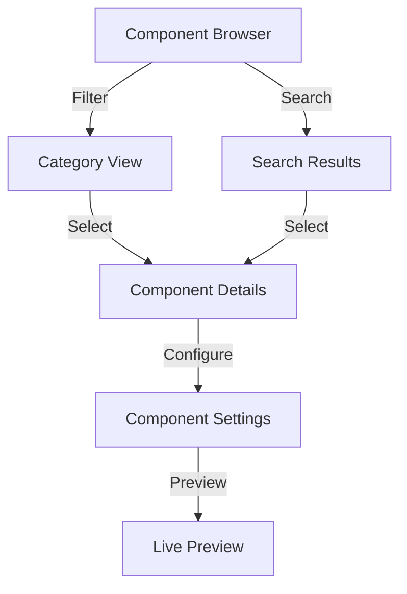
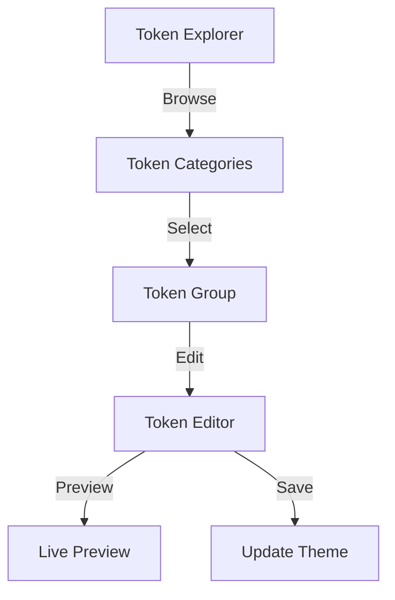
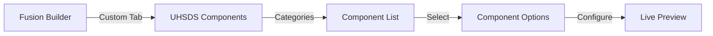

# WordPress Admin Interface & User Experience

## Overview

This document outlines the admin interface implementation for the UHSDS WordPress plugin, focusing on user experience and integration with Fusion Builder.

## Admin Menu Structure

### 1. Main Menu Organization

```yaml
menu_structure:
  uhsds:
    title: "UHSDS Design System"
    icon: "dashicons-art"
    position: 30
    submenus:
      - title: "Components"
        slug: "uhsds-components"
        capability: "edit_posts"
      - title: "Theme Tokens"
        slug: "uhsds-tokens"
        capability: "edit_theme_options"
      - title: "Settings"
        slug: "uhsds-settings"
        capability: "manage_options"
```

## Component Management Interface

### 1. Component Browser



### 2. Component Card UI

```yaml
component_card:
  layout:
    - thumbnail: "400x300px preview"
    - title: "Component Name"
    - status: "Active/Draft/Deprecated"
    - metadata:
        - version
        - last_updated
        - author
    - actions:
        - edit
        - preview
        - disable
```

## Theme Token Management

### 1. Token Explorer Interface



### 2. Token Preview Panel

```yaml
preview_panel:
  features:
    - color_swatches:
        size: "60x60px"
        format: "RGB/HEX"
    - typography_preview:
        sample_text: "The quick brown fox"
        font_details: true
    - spacing_visualization:
        interactive: true
    - responsive_preview:
        breakpoints: true
```

## Fusion Builder Integration

### 1. UHSDS Tab Interface



### 2. Component Options Panel

```yaml
options_panel:
  sections:
    - content:
        title: "Content Options"
        fields:
          - text_inputs
          - media_selectors
          - content_areas
    - design:
        title: "Design Options"
        fields:
          - token_pickers
          - layout_controls
          - spacing_controls
    - advanced:
        title: "Advanced Options"
        fields:
          - custom_classes
          - attributes
          - animations
```

## Real-time Preview System

### 1. Preview Modes

```yaml
preview_modes:
  - desktop:
      width: "100%"
      controls: ["responsive", "theme"]
  - tablet:
      width: "768px"
      controls: ["orientation"]
  - mobile:
      width: "375px"
      controls: ["orientation"]
```

### 2. Preview Controls

```javascript
class PreviewManager {
  constructor() {
    this.modes = ["desktop", "tablet", "mobile"];
    this.themes = ["light", "dark"];
    this.orientations = ["portrait", "landscape"];
  }

  updatePreview(settings) {
    // Preview update logic
  }
}
```

## Settings Interface

### 1. Global Settings

```yaml
global_settings:
  sections:
    - general:
        - plugin_status
        - debug_mode
        - cache_settings
    - github:
        - repository_url
        - branch_selection
        - webhook_settings
    - components:
        - default_status
        - preview_settings
        - cache_duration
    - tokens:
        - sync_frequency
        - fallback_values
        - override_rules
```

### 2. Environment Management

```yaml
environment_manager:
  environments:
    - production:
        - token_set: "main"
        - component_set: "stable"
    - staging:
        - token_set: "dev"
        - component_set: "beta"
    - development:
        - token_set: "local"
        - component_set: "development"
```

## User Interface Components

### 1. Common UI Elements

```scss
// UI Component Styles
.uhsds-admin {
  // Card Component
  &-card {
    border-radius: var(--uhsds-radius-medium);
    box-shadow: var(--uhsds-shadow-card);

    &__header {
      padding: var(--uhsds-spacing-medium);
    }

    &__content {
      padding: var(--uhsds-spacing-medium);
    }
  }

  // Token Picker
  &-token-picker {
    &__swatch {
      width: 40px;
      height: 40px;
    }

    &__value {
      font-family: var(--uhsds-font-mono);
    }
  }
}
```

### 2. Interactive Elements

```javascript
class UHSDSInterface {
  initializeTooltips() {
    // Tooltip initialization
  }

  setupDragAndDrop() {
    // Drag and drop functionality
  }

  initializeModals() {
    // Modal dialog setup
  }
}
```

## Notification System

### 1. Admin Notices

```php
class UHSDS_Admin_Notices {
    public function show_notice($message, $type = 'info') {
        $classes = [
            'notice',
            "notice-{$type}",
            'is-dismissible'
        ];

        printf(
            '<div class="%s"><p>%s</p></div>',
            esc_attr(implode(' ', $classes)),
            esc_html($message)
        );
    }
}
```

### 2. Status Updates

```yaml
status_notifications:
  types:
    - success:
        icon: "checkmark"
        color: "green"
    - warning:
        icon: "warning"
        color: "orange"
    - error:
        icon: "error"
        color: "red"
    - info:
        icon: "info"
        color: "blue"
```

## Accessibility Features

### 1. ARIA Implementation

```yaml
accessibility:
  landmarks:
    - navigation: "Primary navigation"
    - main: "Main content area"
    - complementary: "Sidebar content"
  live_regions:
    - status: "Status messages"
    - alert: "Important notifications"
  focus_management:
    - trap_focus: "Modal dialogs"
    - restore_focus: "After actions"
```

### 2. Keyboard Navigation

```javascript
class KeyboardNavigation {
  setupShortcuts() {
    // Keyboard shortcut bindings
  }

  handleTabNavigation() {
    // Tab key navigation logic
  }

  setupFocusTraps() {
    // Focus trap implementation
  }
}
```

## Performance Optimizations

### 1. Loading States

```yaml
loading_states:
  - skeleton_screens:
      - component_cards
      - token_pickers
      - preview_panels
  - progressive_loading:
      - component_list
      - token_values
      - preview_content
```

### 2. Caching Strategy

```php
class UHSDS_Admin_Cache {
    public function cache_component_data() {
        // Component data caching
    }

    public function cache_token_values() {
        // Token value caching
    }

    public function clear_cache() {
        // Cache clearing logic
    }
}
```
