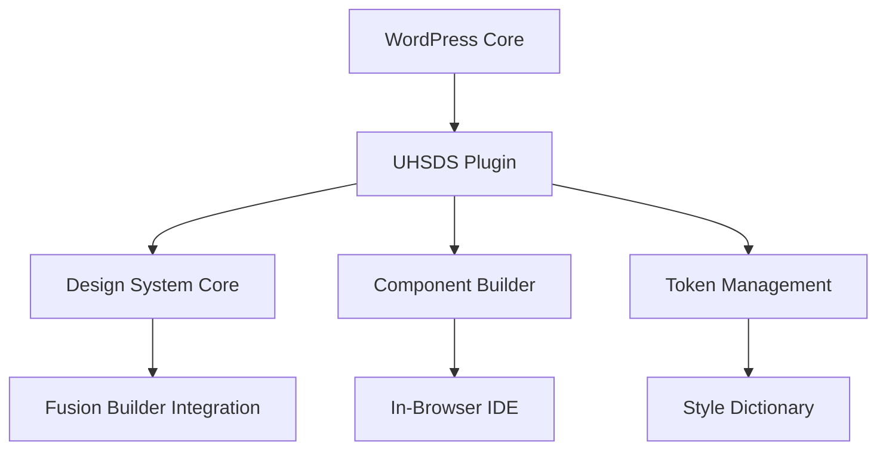
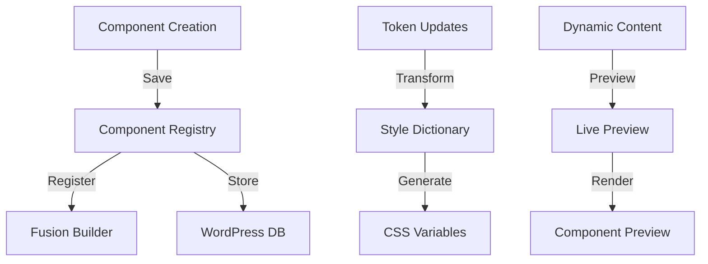
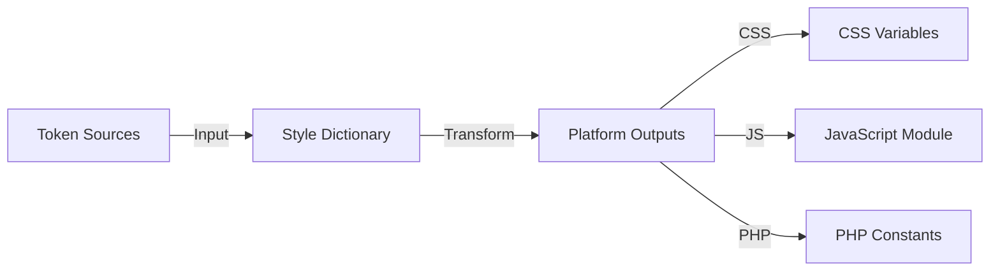
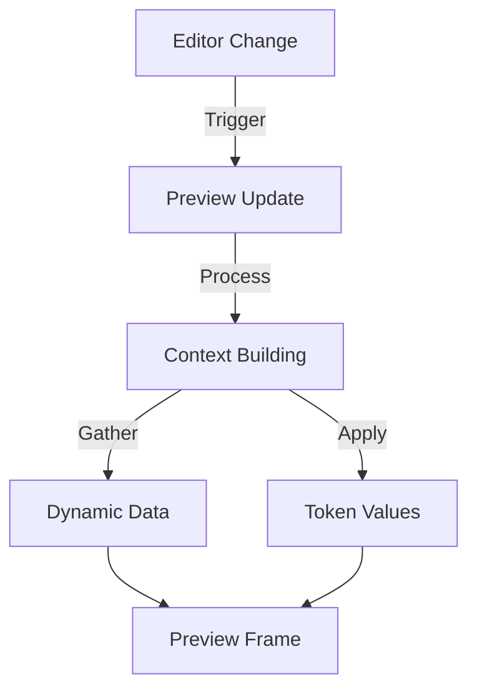

# System Architecture

## Overview

The UHSDS (UH Style Design System) is a comprehensive WordPress plugin that integrates design system capabilities with Fusion Builder, providing both traditional development workflows and in-browser component creation.



## Core Components

### 1. Plugin Structure

```
uhsds/
├── admin/                 # Admin interface and settings
├── core/                  # Core design system functionality
├── components/           # Component library
│   ├── base/            # Base component classes
│   ├── templates/       # Component templates
│   └── registry/        # Component registration
├── ide/                 # In-browser IDE implementation
├── integrations/        # Third-party integrations
│   ├── fusion-builder/  # Avada Fusion Builder
│   ├── acf/            # Advanced Custom Fields
│   └── pods/           # Pods Framework
└── tokens/             # Design token management
```

### 2. Data Flow Architecture



## Component Architecture

### 1. Component Registry

```php
interface ComponentRegistry {
    public function register(Component $component): void;
    public function get(string $id): ?Component;
    public function list(): array;
    public function deregister(string $id): void;
}

class Component {
    protected $id;
    protected $name;
    protected $version;
    protected $content;
    protected $metadata;
    protected $state;
}
```

### 2. Component Storage

```sql
-- Components Table
CREATE TABLE `{prefix}_uhsds_components` (
    `id` BIGINT(20) UNSIGNED NOT NULL AUTO_INCREMENT,
    `name` VARCHAR(255) NOT NULL,
    `version` VARCHAR(20) NOT NULL,
    `content` LONGTEXT NOT NULL,
    `metadata` JSON,
    `state` VARCHAR(20) DEFAULT 'draft',
    `created_at` DATETIME DEFAULT CURRENT_TIMESTAMP,
    `updated_at` DATETIME DEFAULT CURRENT_TIMESTAMP ON UPDATE CURRENT_TIMESTAMP,
    PRIMARY KEY (`id`),
    KEY `name_version` (`name`, `version`),
    KEY `state` (`state`)
);

-- Component Versions Table
CREATE TABLE `{prefix}_uhsds_component_versions` (
    `id` BIGINT(20) UNSIGNED NOT NULL AUTO_INCREMENT,
    `component_id` BIGINT(20) UNSIGNED NOT NULL,
    `version` VARCHAR(20) NOT NULL,
    `content` LONGTEXT NOT NULL,
    `metadata` JSON,
    `created_at` DATETIME DEFAULT CURRENT_TIMESTAMP,
    PRIMARY KEY (`id`),
    FOREIGN KEY (`component_id`) REFERENCES `{prefix}_uhsds_components` (`id`)
);
```

## Token Management Architecture

### 1. Token Pipeline



### 2. Token Storage

```php
interface TokenStorage {
    public function store(array $tokens): void;
    public function retrieve(string $platform): array;
    public function clear(): void;
}

class WordPressTokenStorage implements TokenStorage {
    protected $option_prefix = 'uhsds_tokens_';

    public function store(array $tokens): void {
        foreach ($tokens as $platform => $values) {
            update_option($this->option_prefix . $platform, $values);
        }
    }
}
```

## IDE Architecture

### 1. Editor Components

```typescript
interface EditorArchitecture {
  core: {
    monaco: MonacoEditor;
    preview: PreviewEngine;
    storage: StorageManager;
  };

  extensions: {
    tokenProvider: TokenProvider;
    completionProvider: CompletionProvider;
    validationProvider: ValidationProvider;
  };

  integrations: {
    fusionBuilder: FusionBuilderBridge;
    wordpress: WordPressIntegration;
    dynamicContent: DynamicContentProvider;
  };
}
```

### 2. Preview Architecture



## Integration Architecture

### 1. Fusion Builder Integration

```php
class FusionBuilderIntegration {
    protected $component_registry;
    protected $element_handler;

    public function register_element(Component $component): void {
        $element = $this->create_fusion_element($component);
        $this->element_handler->register($element);
    }

    protected function create_fusion_element(Component $component): array {
        return [
            'name' => $component->getName(),
            'shortcode' => $component->getShortcode(),
            'params' => $this->map_component_params($component),
            'callback' => [$this, 'render_component']
        ];
    }
}
```

### 2. Dynamic Content Integration

```typescript
interface DynamicContentArchitecture {
  providers: {
    acf: ACFProvider;
    pods: PodsProvider;
    wordpress: WordPressProvider;
  };

  preview: {
    engine: PreviewEngine;
    context: ContextManager;
    renderer: TemplateRenderer;
  };

  sync: {
    live: LiveUpdateManager;
    batch: BatchUpdateManager;
  };
}
```

## Security Architecture

### 1. Component Validation

```php
interface SecurityValidator {
    public function validateComponent(Component $component): ValidationResult;
    public function sanitizeContent(string $content): string;
    public function validatePermissions(WP_User $user, string $action): bool;
}

class ComponentValidator implements SecurityValidator {
    protected $allowed_html;
    protected $allowed_css;
    protected $allowed_js;

    public function validateComponent(Component $component): ValidationResult {
        return new ValidationResult([
            'html' => $this->validateHTML($component->getHTML()),
            'css' => $this->validateCSS($component->getCSS()),
            'js' => $this->validateJS($component->getJS())
        ]);
    }
}
```

### 2. Access Control

```php
class AccessControl {
    protected $capability_map = [
        'edit_components' => 'edit_posts',
        'publish_components' => 'publish_posts',
        'delete_components' => 'delete_posts'
    ];

    public function checkPermission(string $action, WP_User $user): bool {
        $required_cap = $this->capability_map[$action] ?? 'manage_options';
        return $user->has_cap($required_cap);
    }
}
```

## Performance Architecture

### 1. Caching Strategy

```php
interface CacheManager {
    public function get(string $key): mixed;
    public function set(string $key, $value, int $ttl = 3600): void;
    public function invalidate(string $key): void;
}

class ComponentCache implements CacheManager {
    protected $wp_cache;

    public function get(string $key): mixed {
        return wp_cache_get($key, 'uhsds_components');
    }

    public function set(string $key, $value, int $ttl = 3600): void {
        wp_cache_set($key, $value, 'uhsds_components', $ttl);
    }
}
```

### 2. Asset Optimization

```php
class AssetManager {
    protected $dependencies = [];
    protected $version;

    public function enqueueAssets(): void {
        $this->enqueueStyles();
        $this->enqueueScripts();
    }

    protected function enqueueStyles(): void {
        wp_enqueue_style(
            'uhsds-components',
            $this->getStylesUrl(),
            [],
            $this->version
        );
    }
}
```

## Error Handling Architecture

### 1. Error Management

```php
interface ErrorHandler {
    public function handle(Throwable $error): void;
    public function log(string $message, string $level = 'error'): void;
    public function getErrors(): array;
}

class ComponentErrorHandler implements ErrorHandler {
    protected $errors = [];

    public function handle(Throwable $error): void {
        $this->errors[] = [
            'message' => $error->getMessage(),
            'code' => $error->getCode(),
            'file' => $error->getFile(),
            'line' => $error->getLine()
        ];

        $this->log($error->getMessage());
    }
}
```

### 2. Recovery Strategies

```php
class RecoveryManager {
    protected $backup_manager;
    protected $state_manager;

    public function createSnapshot(): string {
        return $this->backup_manager->snapshot();
    }

    public function restore(string $snapshot_id): bool {
        return $this->backup_manager->restore($snapshot_id);
    }

    public function rollback(Component $component): bool {
        $previous_version = $this->state_manager->getPreviousVersion($component);
        return $this->state_manager->revert($component, $previous_version);
    }
}
```
