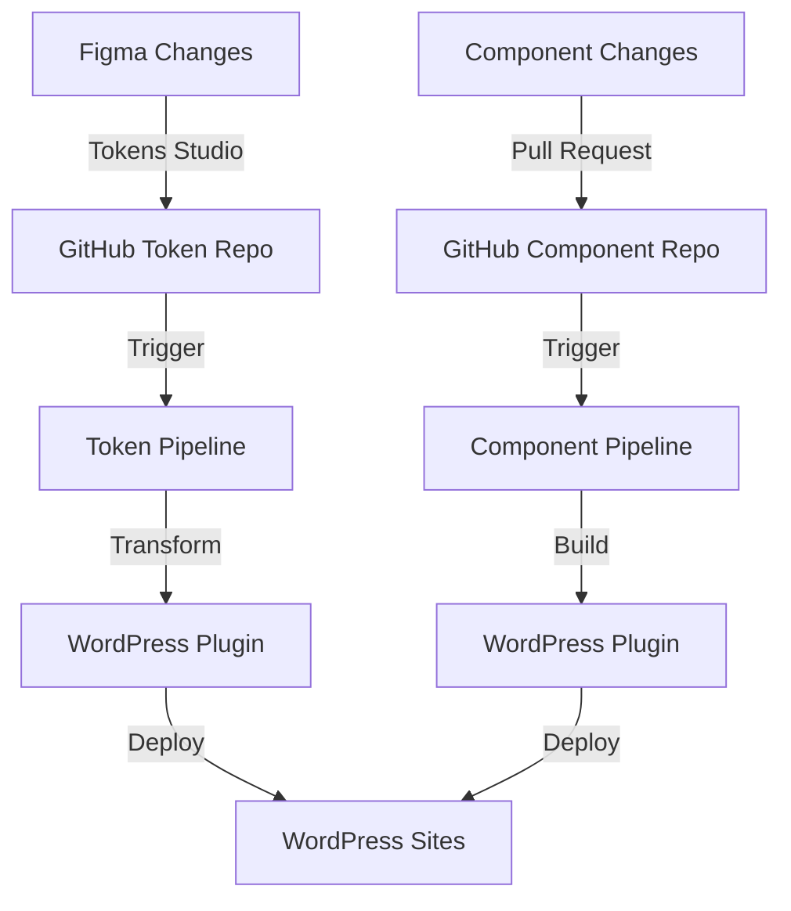
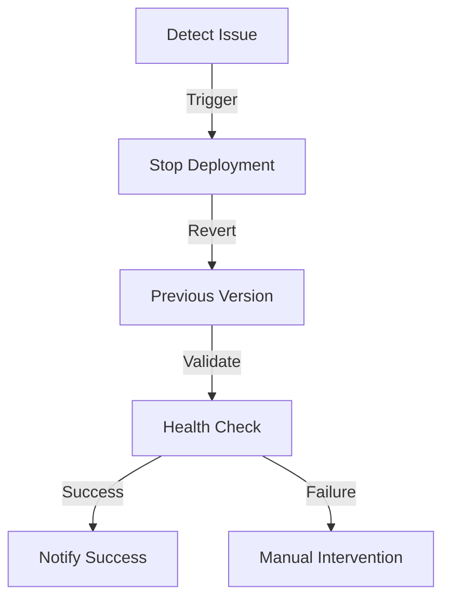

# CI/CD Pipeline Documentation

## Overview

This document outlines the continuous integration and deployment pipeline for managing design tokens and components across the UHSDS ecosystem.

## Pipeline Architecture

### 1. Overall Flow



## Token Pipeline

### 1. Token Update Workflow

```yaml
name: Token Update Pipeline

on:
  push:
    paths:
      - "tokens/**"
    branches:
      - main
      - "dev/**"

jobs:
  process_tokens:
    runs-on: ubuntu-latest
    steps:
      - name: Checkout
        uses: actions/checkout@v3

      - name: Setup Node
        uses: actions/setup-node@v3

      - name: Transform Tokens
        run: |
          npm install style-dictionary
          node transform-tokens.js

      - name: Validate W3C Format
        run: node validate-tokens.js

      - name: Generate CSS
        run: node generate-css.js

      - name: Create Release
        if: github.ref == 'refs/heads/main'
        run: |
          npm version patch
          git push --tags
```

### 2. Token Validation

```javascript
// validate-tokens.js
const validateTokens = (tokens) => {
    const validationRules = {
        required: ['value', 'type'],
        types: ['color', 'dimension', 'fontFamily', ...]
    };

    // Validation logic
};
```

## Component Pipeline

### 1. Component Build Workflow

```yaml
name: Component Build Pipeline

on:
  push:
    paths:
      - "components/**"
    branches:
      - main
      - "feature/**"

jobs:
  build_components:
    runs-on: ubuntu-latest
    steps:
      - name: Checkout
        uses: actions/checkout@v3

      - name: Setup PHP
        uses: shivammathur/setup-php@v2

      - name: Build Components
        run: |
          composer install
          php build-components.php

      - name: Run Tests
        run: vendor/bin/phpunit

      - name: Build Documentation
        run: php generate-docs.php
```

### 2. Component Testing

```php
// component-test-suite.php
class ComponentTestSuite {
    public function runTests() {
        $this->validateStructure();
        $this->testRendering();
        $this->checkTokenUsage();
        $this->validateFusionBuilder();
    }
}
```

## WordPress Integration

### 1. Plugin Update Workflow

```yaml
name: WordPress Plugin Deployment

on:
  workflow_run:
    workflows: ["Token Update Pipeline", "Component Build Pipeline"]
    types:
      - completed

jobs:
  deploy_plugin:
    runs-on: ubuntu-latest
    steps:
      - name: Deploy to WordPress
        if: github.event.workflow_run.conclusion == 'success'
        run: |
          # Plugin deployment steps
```

### 2. Version Management

```php
class VersionManager {
    public function updateVersion($type) {
        switch($type) {
            case 'tokens':
                $this->updateTokenVersion();
                break;
            case 'components':
                $this->updateComponentVersion();
                break;
        }
    }
}
```

## Automated Testing

### 1. Test Matrix

```yaml
test_suite:
  unit_tests:
    - token_validation
    - component_structure
    - fusion_builder_integration
  integration_tests:
    - wordpress_compatibility
    - theme_switching
    - performance_benchmarks
  visual_tests:
    - component_rendering
    - token_application
    - responsive_behavior
```

### 2. Test Implementation

```php
// test-runner.php
class TestRunner {
    public function runTestSuite() {
        try {
            $this->runUnitTests();
            $this->runIntegrationTests();
            $this->runVisualTests();

            return $this->generateReport();
        } catch (TestException $e) {
            $this->handleTestFailure($e);
        }
    }
}
```

## Monitoring and Alerts

### 1. Health Checks

```yaml
monitoring:
  endpoints:
    - token_service: /health
    - component_service: /health
    - wordpress_plugin: /health
  metrics:
    - response_time
    - error_rate
    - deployment_success
```

### 2. Alert Configuration

```yaml
alerts:
  token_updates:
    - validation_failure
    - transformation_error
    - deployment_failure
  component_updates:
    - build_failure
    - test_failure
    - integration_error
```

## Rollback Procedures

### 1. Token Rollback



### 2. Component Rollback

```php
class RollbackManager {
    public function initiateRollback($version) {
        try {
            $this->backupCurrentState();
            $this->revertToVersion($version);
            $this->validateState();
            $this->notifyTeam();
        } catch (RollbackException $e) {
            $this->escalateToTeam($e);
        }
    }
}
```

## Security Measures

### 1. Access Control

```yaml
security:
  github:
    - branch_protection
    - required_reviews
    - status_checks
  wordpress:
    - api_authentication
    - role_based_access
    - audit_logging
```

### 2. Secret Management

```yaml
secrets_management:
  storage:
    - github_secrets
    - environment_variables
  rotation:
    - api_keys
    - deployment_tokens
```

## Documentation Generation

### 1. Automated Docs

```yaml
documentation:
  types:
    - api_reference
    - component_catalog
    - token_inventory
    - deployment_logs
  formats:
    - markdown
    - json_schema
    - openapi
```

### 2. Change Logs

```php
class ChangelogGenerator {
    public function generateChangelog() {
        $changes = $this->collectChanges();
        $this->categorizeChanges();
        $this->formatChangelog();
        $this->publishChangelog();
    }
}
```

---

## CI/CD Agent Review Notes ("The Orchestrator")

### Pipeline Architecture Enhancement

1. **Enhanced Pipeline Flow**

   ```mermaid
   graph TD
       A[Source Changes] -->|Detect| B[Change Classification]
       B -->|Tokens| C[Token Pipeline]
       B -->|Components| D[Component Pipeline]
       B -->|Documentation| E[Docs Pipeline]

       C -->|Process| F[Token Processing]
       D -->|Build| G[Component Build]
       E -->|Generate| H[Doc Generation]

       F -->|Validate| I[Quality Gates]
       G -->|Test| I
       H -->|Verify| I

       I -->|Pass| J[Staging Deploy]
       J -->|Verify| K[Production Deploy]

       L[Monitoring] -.->|Track| C & D & E
       M[Analytics] -.->|Measure| J & K
   ```

2. **Pipeline Configuration**
   ```yaml
   pipeline_config:
     environments:
       development:
         - feature_branches
         - local_testing
         - integration_testing
       staging:
         - main_branch
         - acceptance_testing
         - performance_testing
       production:
         - release_tags
         - canary_deployment
         - blue_green_deployment
     workflows:
       token_pipeline:
         - validation
         - transformation
         - integration
       component_pipeline:
         - build
         - test
         - package
       documentation_pipeline:
         - generation
         - validation
         - publication
   ```

### Critical Pipeline Improvements

1. **Deployment Orchestration**

   ```typescript
   interface DeploymentOrchestrator {
     // Environment management
     prepareEnvironment(env: Environment): Promise<void>;

     // Deployment coordination
     coordinateDeployment(artifacts: Artifact[]): Promise<void>;

     // Health verification
     verifyDeployment(deployment: Deployment): Promise<Health>;

     // Rollback management
     handleRollback(deployment: Deployment): Promise<void>;
   }
   ```

2. **Quality Gates**
   ```php
   class QualityGateManager {
       // Code quality
       public function validateCodeQuality(): QualityReport;

       // Security scanning
       public function performSecurityScan(): SecurityReport;

       // Performance benchmarks
       public function runPerformanceTests(): PerformanceReport;

       // Compliance checks
       public function verifyCompliance(): ComplianceReport;
   }
   ```

### Pipeline Monitoring

1. **Monitoring System**

   ```yaml
   monitoring_system:
     metrics:
       pipeline_health:
         - build_success_rate
         - deployment_success_rate
         - rollback_frequency
       performance:
         - build_duration
         - deployment_duration
         - test_execution_time
       quality:
         - code_coverage
         - test_success_rate
         - security_findings
     alerts:
       critical:
         - pipeline_failure
         - deployment_failure
         - security_breach
       warning:
         - long_duration
         - test_failures
         - quality_degradation
   ```

2. **Analytics Platform**
   ```typescript
   interface PipelineAnalytics {
     // Performance tracking
     trackPipelinePerformance(): Metrics;

     // Quality metrics
     measureQualityMetrics(): QualityScore;

     // Deployment analytics
     analyzeDeployments(): DeploymentAnalytics;

     // Trend analysis
     analyzeTrends(): TrendReport;
   }
   ```

### Automation Enhancements

1. **Automated Recovery**

   ```php
   interface AutoRecovery {
       // Failure detection
       public function detectFailures(): FailureReport;

       // Recovery actions
       public function executeRecovery(failure: Failure): void;

       // Health restoration
       public function restoreSystemHealth(): void;

       // Incident reporting
       public function reportIncident(incident: Incident): void;
   }
   ```

2. **Pipeline Optimization**
   ```yaml
   optimization:
     build_optimization:
       - parallel_execution
       - caching_strategy
       - resource_allocation
     deployment_optimization:
       - progressive_rollout
       - traffic_management
       - resource_scaling
     testing_optimization:
       - test_parallelization
       - selective_testing
       - distributed_testing
   ```

### Next Steps

1. **Immediate Actions**

   - Implement enhanced monitoring
   - Add automated recovery
   - Improve quality gates

2. **Short-term Goals**

   - Build analytics dashboard
   - Enhance deployment strategies
   - Improve pipeline performance

3. **Long-term Vision**
   - Implement AI-powered pipeline optimization
   - Create predictive failure detection
   - Develop self-healing systems
