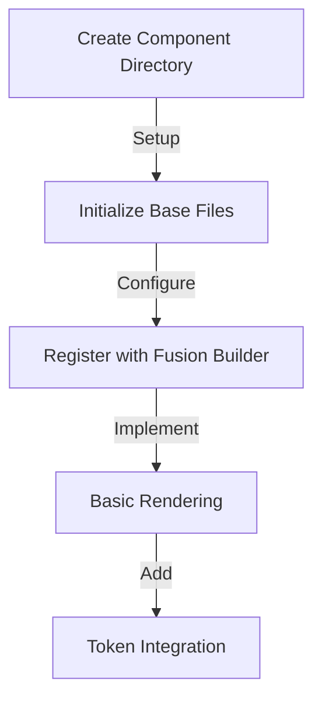
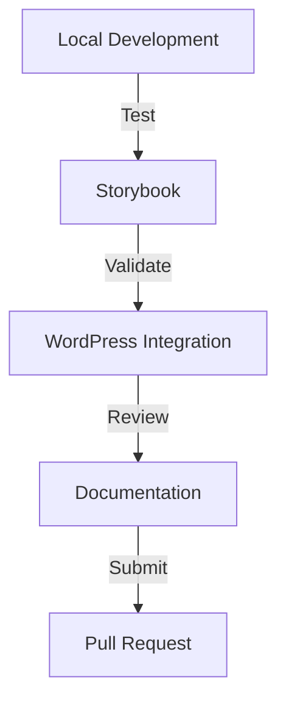
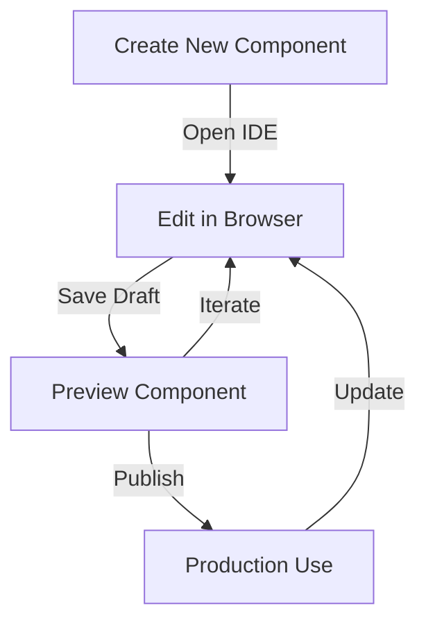

# Component Development Guidelines

## Overview

This document outlines the standards and processes for developing components that integrate with both the UHSDS design system and Fusion Builder. Components can be developed either through traditional development workflows or using the in-browser IDE component builder.

## Component Architecture

### 1. File Structure

```
component-name/
├── class-component-name.php      # Main component class
├── templates/
│   ├── component.timber.twig     # Timber template
│   └── component.php            # PHP fallback template
├── assets/
│   ├── js/
│   │   ├── editor.js           # Fusion Builder editor integration
│   │   └── frontend.js         # Frontend functionality
│   └── css/
│       ├── editor.css          # Editor-specific styles
│       └── frontend.css        # Component styles
├── preview/
│   ├── preview.php            # Live preview renderer
│   └── template.php           # Preview template
└── docs/
    ├── README.md              # Component documentation
    └── CHANGELOG.md           # Version history
```

### 2. Component Base Class

```php
class UHSDS_Component_Base extends Fusion_Element {
    protected $token_manager;
    protected $timber;

    public function __construct() {
        parent::__construct();
        $this->setup_tokens();
        $this->register_timber();
        $this->register_assets();
    }

    protected function setup_tokens() {
        // Token integration setup
    }

    protected function register_timber() {
        // Timber template registration
    }
}
```

## Development Workflow

### 1. Initial Setup



### 2. Development Cycle



## Component Implementation

### 1. Timber Template

```twig
{# component.timber.twig #}
<div class="uhsds-{{ component_name }}" data-version="{{ version }}">
    
        <h2 class="uhsds-{{ component_name }}__title">{{ title }}</h2>
    

    <div class="uhsds-{{ component_name }}__content">
        {{ content }}
    </div>

    
</div>
```

### 2. PHP Integration

```php
class UHSDS_Component_Example extends UHSDS_Component_Base {
    public function get_builder_options() {
        return [
            'title' => [
                'type' => 'textfield',
                'heading' => esc_attr__('Title'),
                'description' => esc_attr__('Enter component title'),
                'preview' => $this->get_preview_template()
            ],
            'design' => [
                'type' => 'design_tab',
                'fields' => $this->get_design_options()
            ]
        ];
    }

    protected function get_design_options() {
        return [
            'tokens' => $this->token_manager->get_available_tokens(),
            'layouts' => $this->get_layout_options()
        ];
    }
}
```

## Token Integration

### 1. Token Usage

```scss
.uhsds-component {
  // Use CSS custom properties
  color: var(--uhsds-color-primary);
  font-family: var(--uhsds-font-family-base);

  // Spacing tokens
  padding: var(--uhsds-spacing-medium);
  margin: var(--uhsds-spacing-large);

  // Responsive tokens
  @media (min-width: var(--uhsds-breakpoint-medium)) {
    // Responsive styles
  }
}
```

### 2. Token Registration

```php
protected function register_component_tokens() {
    $tokens = [
        'color' => [
            'primary' => ['default' => '#000000'],
            'secondary' => ['default' => '#FFFFFF']
        ],
        'spacing' => [
            'small' => ['default' => '8px'],
            'medium' => ['default' => '16px']
        ]
    ];

    $this->token_manager->register_tokens($tokens);
}
```

## Testing Requirements

### 1. Unit Tests

```php
class Component_Test extends WP_UnitTestCase {
    public function test_component_rendering() {
        // Test component output
    }

    public function test_token_integration() {
        // Test token application
    }
}
```

### 2. Integration Tests

```php
class Component_Integration_Test extends WP_Test_Case {
    public function test_fusion_builder_integration() {
        // Test Fusion Builder registration
    }

    public function test_preview_rendering() {
        // Test live preview
    }
}
```

## Performance Guidelines

### 1. Asset Loading

- Enqueue assets only when needed
- Use asset versioning
- Implement lazy loading where appropriate
- Minimize CSS/JS footprint

### 2. Rendering Optimization

- Cache expensive operations
- Minimize DOM manipulations
- Use efficient selectors
- Implement render caching

## Documentation Standards

### 1. Component README

```markdown
# Component Name

## Usage

[Basic usage instructions]

## Properties

| Name | Type | Default | Description |
| ---- | ---- | ------- | ----------- |
| prop | type | default | description |

## Examples

[Code examples]

## Token Usage

[Token documentation]
```

### 2. Code Comments

```php
/**
 * Component rendering method.
 *
 * @param array $args Component arguments
 * @param string $content Nested content
 * @return string Rendered component
 */
public function render($args, $content = '') {
    // Implementation
}
```

## Quality Checklist

### 1. Development

- [ ] Component follows file structure
- [ ] Implements base class correctly
- [ ] Uses Timber templating
- [ ] Proper token integration
- [ ] Asset optimization

### 2. Testing

- [ ] Unit tests written
- [ ] Integration tests passed
- [ ] Browser testing completed
- [ ] Performance benchmarks met
- [ ] Accessibility validated

### 3. Documentation

- [ ] README complete
- [ ] Code documented
- [ ] Change log updated
- [ ] Token usage documented
- [ ] Examples provided

## In-Browser Component Development

### 1. Component Builder Interface

The in-browser component builder provides a modern IDE experience for creating and editing components directly within WordPress.



### 2. IDE Features

- **Smart Code Editor**

  - Syntax highlighting for HTML, CSS, and JavaScript
  - IntelliSense for design tokens and component APIs
  - Real-time error checking and linting
  - Code formatting and auto-completion
  - Token autocomplete suggestions

- **Multi-Panel Interface**
  ```
  +-----------------+------------------+
  |    HTML         |                 |
  |    Editor       |    Live         |
  +-----------------+    Preview      |
  |    CSS          |                 |
  |    Editor       |                 |
  +-----------------+    Panel        |
  |    JavaScript   |                 |
  |    Editor       |                 |
  +-----------------+------------------+
  ```

### 3. Component Lifecycle States

- **New**: Initial creation state
- **Draft**: Work in progress
- **Published**: Live in production
- **Archived**: Soft-deleted state

```javascript
{
  "componentState": {
    "status": "draft", // new, draft, published, archived
    "version": "1.0.0",
    "lastModified": "2024-01-20T10:00:00Z",
    "author": "user@example.com",
    "publishedVersion": null
  }
}
```

### 4. Real-Time Preview

- Live preview updates as you type
- Device viewport simulation
- Token theme switching
- Content injection testing
- WYSIWYG editor integration testing

### 5. Version Control

```json
{
  "versionHistory": [
    {
      "version": "1.0.0",
      "timestamp": "2024-01-20T10:00:00Z",
      "state": "published",
      "author": "user@example.com",
      "changes": ["Initial component release"]
    }
  ]
}
```

### 6. Component Storage

Components created in the browser are stored in the WordPress database with the following structure:

```sql
CREATE TABLE wp_uhsds_components (
    id BIGINT(20) UNSIGNED NOT NULL AUTO_INCREMENT,
    name VARCHAR(255) NOT NULL,
    slug VARCHAR(255) NOT NULL,
    html_content TEXT,
    css_content TEXT,
    js_content TEXT,
    state VARCHAR(20) DEFAULT 'draft',
    version VARCHAR(20),
    created_at DATETIME,
    updated_at DATETIME,
    published_at DATETIME NULL,
    author_id BIGINT(20),
    PRIMARY KEY (id)
);
```

### 7. Integration with Fusion Builder

- Components automatically register with Fusion Builder
- Drag-and-drop functionality in page builder
- Dynamic property controls generation
- Live preview in builder interface

### 8. Development Guidelines

#### Code Organization

```html
<!-- Component Structure -->
<div class="uhsds-component">
  <!-- Component markup -->
</div>

<style>
  /* Component styles */
  .uhsds-component {
    /* Use design tokens */
    color: var(--uhsds-color-text);
  }
</style>

<script>
  // Component behavior
  class UHSDSComponent {
    constructor() {
      // Initialize component
    }
  }
</script>
```

#### Best Practices

- Use design tokens for all visual properties
- Follow component naming conventions
- Implement responsive design patterns
- Add proper documentation
- Test across different contexts

---

## Component Development Agent Technical Review ("The Craftsperson")

### Component System Architecture Enhancements

1. **Component Composition System**

   ```mermaid
   graph TD
       A[Base Component] -->|Extends| B[Composite Component]
       B -->|Contains| C[Slot System]
       B -->|Contains| D[Fragment System]

       E[State Manager] -->|Manages| B
       F[Event System] -->|Controls| B

       G[Token Consumer] -.->|Applies| B
       H[Theme Manager] -.->|Styles| B

       I[Development Tools] -->|Builds| J[Component Package]
       J -->|Registers| K[Component Registry]
   ```

2. **Enhanced Component Base**

   ```php
   abstract class UHSDS_Enhanced_Component_Base {
       // Composition system
       protected function registerSlot(string $name, array $config): void;
       protected function registerFragment(string $name, array $config): void;

       // State management
       protected function defineState(array $initialState): void;
       protected function handleStateChange(string $key, $value): void;

       // Event handling
       protected function registerEventHandlers(): void;
       protected function emitEvent(string $event, array $data): void;

       // Token integration
       protected function consumeTokens(array $tokenPaths): void;
       protected function handleTokenUpdate(string $token): void;

       // Development utilities
       protected function validateStructure(): ValidationResult;
       protected function generateDocs(): Documentation;
   }
   ```

3. **Development Tooling**
   ```typescript
   interface ComponentDevelopmentKit {
     // Component scaffolding
     createComponent(config: ComponentConfig): void;

     // Development environment
     setupDevEnvironment(): DevEnvironment;

     // Testing utilities
     runTests(component: string): TestResults;

     // Documentation
     generateDocs(component: string): Documentation;

     // Build system
     buildComponent(component: string): BuildResult;
   }
   ```

### Critical Improvements Needed

1. **Component Testing Framework**

   ```php
   class ComponentTestingSuite {
       // Unit testing
       public function testStructure(): TestResult;
       public function testRendering(): TestResult;
       public function testState(): TestResult;

       // Integration testing
       public function testTokenIntegration(): TestResult;
       public function testThemeCompatibility(): TestResult;
       public function testFusionBuilder(): TestResult;

       // Performance testing
       public function benchmarkRendering(): PerformanceMetrics;
       public function analyzeBundle(): BundleAnalysis;
       public function testMemoryUsage(): MemoryProfile;
   }
   ```

2. **Development Environment**

   ```yaml
   development_environment:
     features:
       hot_reload:
         enabled: true
         watch_paths: ["templates", "assets"]
       component_playground:
         enabled: true
         features:
           - state_inspector
           - event_logger
           - token_preview
       error_handling:
         boundaries: true
         detailed_stack: true
         recovery_options: true
     tools:
       compiler:
         - typescript
         - sass
         - twig
       linting:
         - phpcs
         - eslint
         - stylelint
       testing:
         - jest
         - phpunit
         - cypress
   ```

3. **Component Documentation System**
   ```typescript
   interface ComponentDocGenerator {
     // API documentation
     generateAPI(component: string): APIDoc;

     // Usage examples
     generateExamples(component: string): Examples;

     // Integration guides
     generateIntegrationGuides(component: string): Guides;

     // Visual documentation
     generateVisualDocs(component: string): VisualDocs;
   }
   ```

### Integration Recommendations

1. **State Management System**

   ```php
   interface ComponentState {
       // State definition
       public function defineState(array $initial): void;

       // State updates
       public function updateState(string $key, $value): void;

       // State subscriptions
       public function subscribeToState(string $key, callable $handler): void;

       // State persistence
       public function persistState(): void;
   }
   ```

2. **Event System**
   ```typescript
   interface ComponentEvents {
     // Event registration
     registerEvent(name: string, config: EventConfig): void;

     // Event handling
     handleEvent(name: string, data: any): void;

     // Event bubbling
     bubbleEvent(name: string, data: any): void;

     // Event debugging
     debugEvent(name: string): EventDebugInfo;
   }
   ```

### Next Implementation Steps

1. **Immediate Actions**

   - Implement enhanced component base class
   - Develop component testing suite
   - Create development toolkit

2. **Short-term Goals**

   - Build component playground
   - Enhance documentation system
   - Improve build process

3. **Long-term Vision**
   - Implement AI-assisted component development
   - Create advanced component analytics
   - Develop component optimization system
