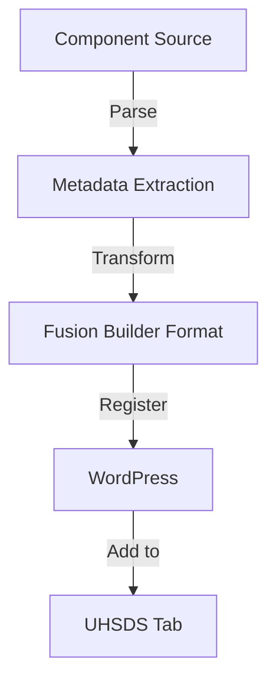
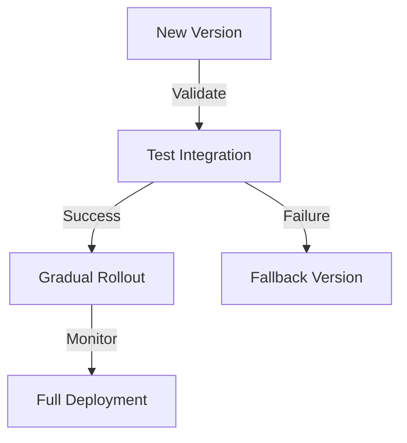
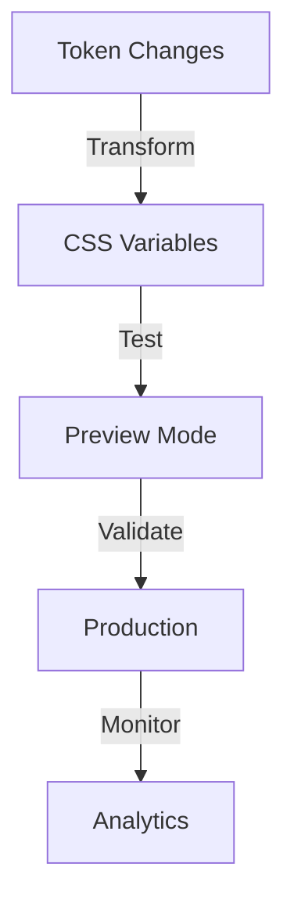

# Fusion Builder Integration Specifications

## Overview

This document outlines the technical requirements for integrating UHSDS components with Fusion Builder, ensuring a seamless experience while maintaining Avada's core functionality.

## Component Registration

### 1. UHSDS Tab Implementation

```php
// Non-destructive tab addition
add_filter('fusion_builder_elements_tabs', 'add_uhsds_tab');
add_filter('fusion_builder_elements_category', 'categorize_uhsds_elements');
```

### 2. Component Registration Process



## Integration Points

### 1. Component Structure

```yaml
component:
  name: "UHSDS Component"
  shortcode: "uhsds_component"
  preview:
    type: "live"
    js: "component-preview.js"
    css: "component-preview.css"
  options:
    - design_tab: true
    - advanced_tab: true
    - uhsds_tokens_tab: true
```

### 2. Token Integration

```yaml
token_integration:
  - css_variables:
      source: "theme-tokens.json"
      format: "w3c"
  - fusion_options:
      type: "token_picker"
      preview: "live"
```

## Component Features

### 1. Required Capabilities

- Live preview rendering
- Token value selection
- Responsive preview
- Documentation access
- Version indication

### 2. Optional Features

- Storybook preview link
- Figma reference
- Change history
- Usage analytics

## Implementation Guidelines

### 1. Component Registration

```php
// Component registration template
class UHSDS_Component extends Fusion_Element {
    public function __construct() {
        parent::__construct();
        add_shortcode('uhsds_component', [$this, 'render']);
        // Additional setup
    }

    public function render($args, $content = '') {
        // Rendering logic
    }
}
```

### 2. Token Management

```php
// Token integration
class UHSDS_Tokens {
    public function register_token_options() {
        // Token registration logic
    }

    public function render_token_picker() {
        // Token picker UI
    }
}
```

## User Interface Elements

### 1. Component Browser

```yaml
ui_elements:
  browser:
    - dedicated_tab: true
    - category_filters: true
    - search_functionality: true
    - preview_thumbnails: true
```

### 2. Token Picker

```yaml
token_picker:
  features:
    - color_preview: true
    - typography_preview: true
    - spacing_visualization: true
    - value_comparison: true
```

## Performance Considerations

### 1. Asset Loading

- Lazy load component assets
- Cache token values
- Optimize preview rendering
- Minimize DOM updates

### 2. State Management

- Track component versions
- Monitor token updates
- Cache preview data
- Track usage metrics

## Error Handling

### 1. Component Errors

```php
try {
    // Component rendering
} catch (ComponentException $e) {
    // Graceful fallback
    // User notification
    // Error logging
}
```

### 2. Token Errors

```php
try {
    // Token processing
} catch (TokenException $e) {
    // Default value fallback
    // Sync status update
    // Error notification
}
```

## Migration Strategy

### 1. Component Updates



### 2. Token Updates



## Documentation Requirements

### 1. Component Documentation

- Usage guidelines
- Token requirements
- Version history
- Known limitations
- Example implementations

### 2. Integration Documentation

- Setup instructions
- Troubleshooting guide
- Performance tips
- Update procedures
- Migration guides

---

## System Integration Agent Technical Review ("The Integrator")

### Integration Architecture Enhancements

1. **Enhanced Integration Layer**

   ```mermaid
   graph TD
       A[UHSDS Core] -->|Bridge| B[Integration Layer]
       B -->|Register| C[Fusion Builder]
       B -->|Sync| D[WordPress Core]

       E[Event Bus] -->|Notify| B
       F[State Manager] -->|Update| B

       G[Cache System] -.->|Optimize| B
       H[Monitor] -.->|Track| B

       I[Migration Manager] -->|Control| B
       J[Version Controller] -->|Manage| B
   ```

2. **Component Bridge System**

   ```php
   interface ComponentBridge {
       // Component registration
       public function registerWithFusion(Component $component): void;

       // State synchronization
       public function syncComponentState(string $id, array $state): void;

       // Event handling
       public function handleFusionEvents(string $event, array $data): void;

       // Error recovery
       public function handleIntegrationError(Exception $e): void;
   }
   ```

3. **Integration Pipeline**
   ```yaml
   integration_pipeline:
     stages:
       preprocessing:
         - component_validation
         - dependency_check
         - capability_verification
       integration:
         - fusion_registration
         - wordpress_hooks
         - asset_registration
       monitoring:
         - performance_tracking
         - error_logging
         - usage_analytics
     recovery:
       - error_boundaries
       - fallback_modes
       - state_recovery
   ```

### Critical Improvements Needed

1. **State Synchronization**

   ```typescript
   interface StateSyncManager {
     // State tracking
     trackComponentState(component: string): void;

     // Conflict resolution
     resolveStateConflicts(states: StateMap): void;

     // State recovery
     recoverComponentState(component: string): void;

     // Performance optimization
     optimizeStateSync(): void;
   }
   ```

2. **Event Management**

   ```php
   class IntegrationEventManager {
       // Event registration
       public function registerIntegrationEvents(): void;

       // Event handling
       public function handleCrossSystemEvents(): void;

       // Event monitoring
       public function monitorEventFlow(): void;

       // Event optimization
       public function optimizeEventDispatch(): void;
   }
   ```

3. **Error Handling System**
   ```yaml
   error_handling:
     strategies:
       component_errors:
         - validation_errors
         - rendering_errors
         - state_errors
       integration_errors:
         - registration_failures
         - sync_failures
         - event_failures
       recovery_actions:
         - state_recovery
         - component_reload
         - system_reset
     monitoring:
       - error_tracking
       - performance_impact
       - user_experience
   ```

### Performance Optimizations

1. **Resource Management**

   ```php
   interface ResourceOptimizer {
       // Asset optimization
       public function optimizeAssets(): void;

       // Cache management
       public function manageCache(): void;

       // Load balancing
       public function balanceLoad(): void;

       // Resource monitoring
       public function monitorResources(): void;
   }
   ```

2. **Integration Cache**
   ```typescript
   interface IntegrationCache {
     // Cache strategies
     setCacheStrategy(strategy: CacheStrategy): void;

     // Cache operations
     cacheIntegrationData(key: string, data: any): void;

     // Cache invalidation
     invalidateCache(pattern: string): void;

     // Cache analysis
     analyzeCacheUsage(): CacheMetrics;
   }
   ```

### Monitoring Requirements

1. **Integration Health**

   ```php
   class IntegrationHealthMonitor {
       // Health checks
       public function checkIntegrationHealth(): HealthStatus;

       // Performance monitoring
       public function monitorPerformance(): PerformanceMetrics;

       // System diagnostics
       public function runDiagnostics(): DiagnosticReport;

       // Alert system
       public function handleAlerts(): void;
   }
   ```

2. **Analytics System**
   ```yaml
   analytics_system:
     metrics:
       performance:
         - response_times
         - memory_usage
         - cpu_utilization
       reliability:
         - error_rates
         - recovery_success
         - uptime_tracking
       usage:
         - component_usage
         - feature_adoption
         - user_patterns
     reporting:
       - real_time_dashboard
       - scheduled_reports
       - alert_triggers
   ```

### Next Implementation Steps

1. **Immediate Actions**

   - Implement enhanced error handling
   - Develop state synchronization
   - Create monitoring system

2. **Short-term Goals**

   - Build integration dashboard
   - Improve cache system
   - Enhance performance monitoring

3. **Long-term Vision**
   - Implement predictive error prevention
   - Develop advanced analytics
   - Create AI-assisted debugging
