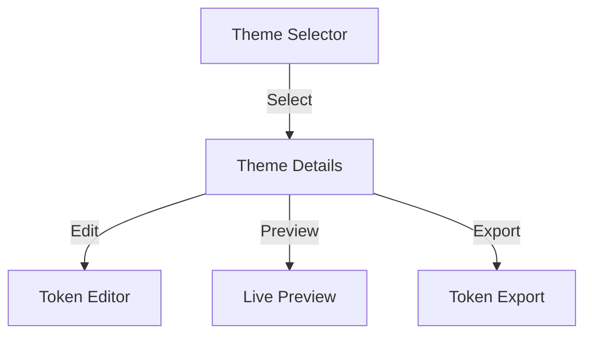
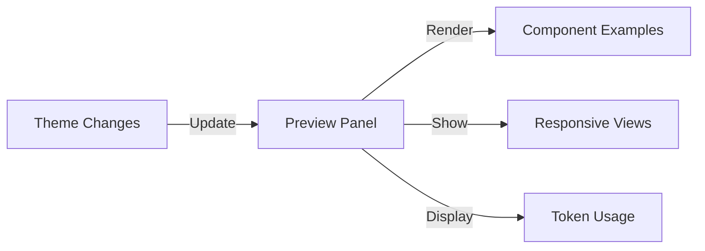
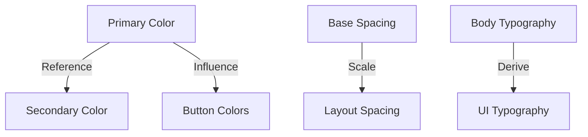
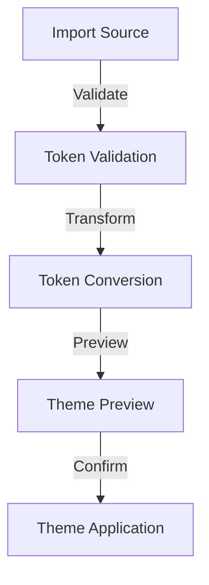

# Theme Customization Interface

## Overview

The theme customization interface allows users to manage, customize, and preview design tokens across different themes. It provides a visual way to modify token values while maintaining the connection to Figma's Tokens Studio and the W3C-compliant token format.

## Theme Management

### 1. Theme Selector Interface



### 2. Theme Structure

```yaml
theme:
  name: "Corporate Primary"
  version: "2.0.0"
  status: "active"
  tokens:
    colors:
      primary:
        value: "#007AFF"
        type: "color"
      secondary:
        value: "{color.primary}"
        type: "color"
    typography:
      body:
        fontFamily:
          value: "Inter"
          type: "fontFamily"
    spacing:
      base:
        value: "8px"
        type: "dimension"
```

## Token Customization Interface

### 1. Visual Token Editor

```
┌─ Token Editor ──────────────────────────────────────┐
│ ┌─Token Navigation─┐ ┌─Token Editor───────────────┐ │
│ │                 │ │ Color: Primary              │ │
│ │ ● Colors        │ │ ┌─Color Picker──────────┐   │ │
│ │   ├─ Primary    │ │ │                       │   │ │
│ │   ├─ Secondary  │ │ │     [Color Wheel]     │   │ │
│ │   └─ Accent     │ │ │                       │   │ │
│ │                 │ │ │ #007AFF               │   │ │
│ │ ● Typography    │ │ └───────────────────────┘   │ │
│ │   ├─ Body       │ │                             │ │
│ │   └─ Display    │ │ Preview:                    │ │
│ │                 │ │ [Sample Text]               │ │
│ │ ● Spacing       │ │ [Sample Button]             │ │
│ │   ├─ Base       │ │                             │ │
│ │   └─ Layout     │ │ Used in: 24 components      │ │
│ └─────────────────┘ └─────────────────────────────┘ │
└──────────────────────────────────────────────────────┘
```

### 2. Token Type Editors

#### Color Token Editor

```yaml
color_editor:
  features:
    - color_wheel
    - rgb_inputs
    - hex_input
    - opacity_slider
    - color_palette
    - color_suggestions
  preview:
    - text_samples
    - ui_elements
    - accessibility_contrast
```

#### Typography Token Editor

```yaml
typography_editor:
  features:
    - font_family_selector
    - font_weight_picker
    - size_input
    - line_height_control
    - letter_spacing_control
  preview:
    - sample_text
    - responsive_preview
    - scale_visualization
```

#### Spacing Token Editor

```yaml
spacing_editor:
  features:
    - numeric_input
    - unit_selector
    - visual_slider
    - spacing_scale
  preview:
    - layout_grid
    - component_spacing
    - responsive_behavior
```

## Theme Preview System

### 1. Component Preview



### 2. Preview Controls

```yaml
preview_controls:
  viewport:
    - desktop: 1200px
    - tablet: 768px
    - mobile: 375px
  themes:
    - light_mode
    - dark_mode
  components:
    - primary_buttons
    - typography_scale
    - spacing_examples
```

## Token Relationships

### 1. Token Dependencies



### 2. Alias Management

```yaml
alias_system:
  color:
    primary:
      main: "#007AFF"
      light: "lighten(primary.main, 20%)"
      dark: "darken(primary.main, 20%)"
  spacing:
    base: "8px"
    medium: "multiply(base, 2)"
    large: "multiply(base, 3)"
```

## Theme Version Control

### 1. Version Management

```yaml
version_control:
  current_version: "2.0.0"
  history:
    - version: "2.0.0"
      date: "2023-12-01"
      changes:
        - "Updated primary color"
        - "Added new spacing scale"
    - version: "1.9.0"
      date: "2023-11-15"
      changes:
        - "Updated typography system"
```

### 2. Theme Comparison

```
┌─ Theme Comparison ────────────────────────────────┐
│ ┌─Version 1.9.0────┐ ┌─Version 2.0.0───────────┐ │
│ │ Primary Color    │ │ Primary Color           │ │
│ │ #0066CC         │ │ #007AFF                 │ │
│ │                 │ │                         │ │
│ │ Base Spacing    │ │ Base Spacing            │ │
│ │ 4px            │ │ 8px                     │ │
│ └─────────────────┘ └─────────────────────────┘ │
└──────────────────────────────────────────────────┘
```

## Theme Export/Import

### 1. Export Options

```yaml
export_formats:
  - style_dictionary_json
  - w3c_design_tokens
  - css_variables
  - scss_variables
  - figma_tokens
```

### 2. Import Process



## Theme Documentation

### 1. Token Documentation

```yaml
token_documentation:
  sections:
    - usage_guidelines
    - token_relationships
    - component_dependencies
    - migration_notes
    - accessibility_guidelines
```

### 2. Theme Guidelines

```markdown
# Theme Usage Guidelines

## Color System

- Primary colors should maintain 4.5:1 contrast ratio
- Secondary colors should be derived from primary
- Use semantic color tokens for consistent meaning

## Typography System

- Base size: 16px
- Scale ratio: 1.25
- Use typography tokens for consistent hierarchy

## Spacing System

- Base unit: 8px
- Use spacing tokens for consistent layout
- Follow 8-point grid system
```

## Performance Considerations

### 1. Token Updates

```yaml
performance:
  caching:
    - token_values
    - computed_styles
    - preview_renders
  optimization:
    - lazy_loading
    - batch_updates
    - selective_rendering
```

### 2. Preview Generation

```yaml
preview_optimization:
  strategies:
    - component_caching
    - virtual_dom_diffing
    - progressive_loading
  thresholds:
    - max_concurrent_previews: 5
    - preview_timeout: 2000ms
```
