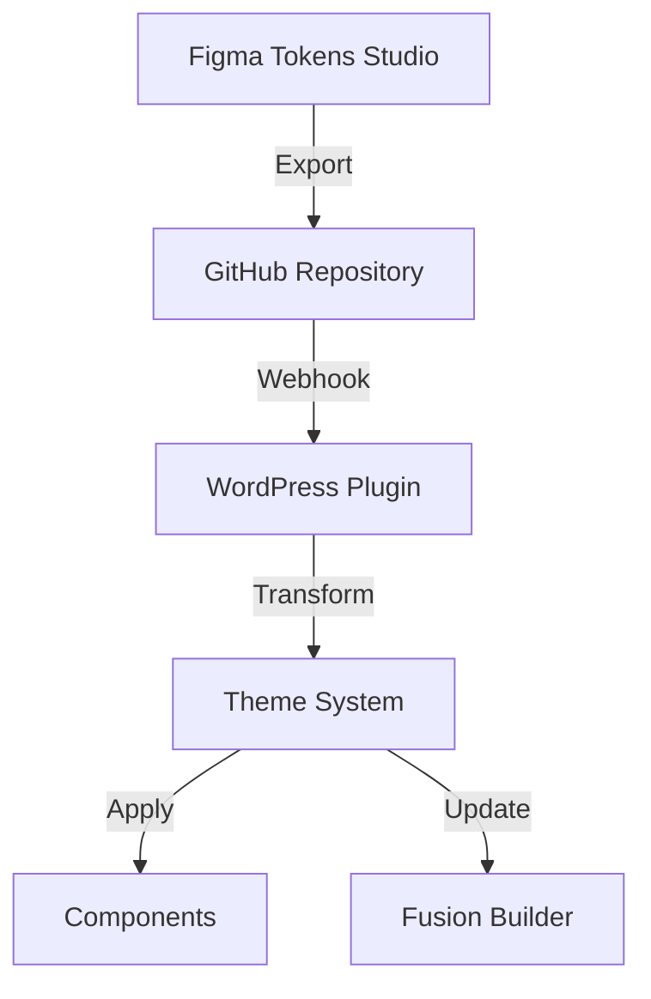
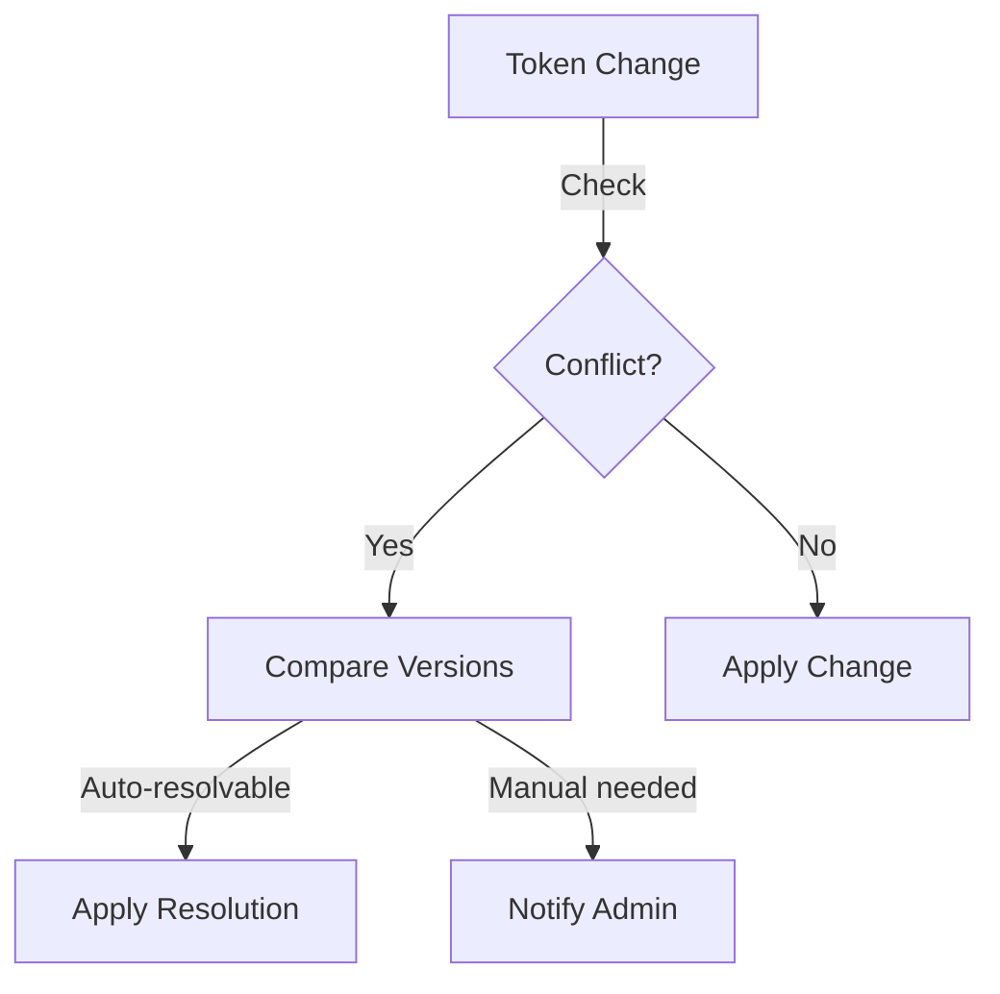

# Theme Synchronization System

## Overview

This document outlines the synchronization system that maintains theme consistency across Figma, GitHub, and WordPress, ensuring that design tokens remain synchronized across all platforms.

## Platform Integration

### 1. Synchronization Flow



### 2. Data Format Transformation

```yaml
transformation_pipeline:
  figma:
    format: "tokens-studio-json"
    validation: "tokens-schema"
  github:
    format: "style-dictionary-json"
    validation: "w3c-schema"
  wordpress:
    format: "css-variables"
    validation: "css-syntax"
```

## Synchronization Mechanisms

### 1. Webhook System

```php
class ThemeWebhookHandler {
    public function handleGitHubWebhook($payload) {
        try {
            // Validate webhook signature
            $this->validateSignature($payload);

            // Process token updates
            $this->processTokenUpdates($payload);

            // Notify admin
            $this->notifyAdmin('Theme tokens updated successfully');

        } catch (WebhookException $e) {
            $this->handleError($e);
        }
    }
}
```

### 2. Version Control

```yaml
version_management:
  tracking:
    - token_values
    - token_metadata
    - component_dependencies
  conflict_resolution:
    - merge_strategy: "latest_wins"
    - conflict_notification: true
    - rollback_support: true
```

## Platform-Specific Handling

### 1. Figma Integration

```yaml
figma_integration:
  tokens_studio:
    export:
      - format: "json"
      - frequency: "on_change"
      - validation: true
    sync:
      - direction: "bidirectional"
      - conflict_resolution: "manual"
```

### 2. GitHub Integration

```yaml
github_integration:
  repository:
    structure:
      - tokens/
      - themes/
      - documentation/
  webhooks:
    - push_events
    - pull_request_events
  branches:
    - main: "production"
    - dev: "staging"
```

### 3. WordPress Integration

```yaml
wordpress_integration:
  storage:
    - database_tables
    - cache_system
  application:
    - css_variables
    - fusion_builder_integration
  updates:
    - automatic_sync
    - manual_override
```

## Conflict Resolution

### 1. Conflict Detection



### 2. Resolution Strategies

```yaml
conflict_resolution:
  strategies:
    - latest_wins:
        priority: 1
        conditions: "non-breaking"
    - manual_review:
        priority: 2
        conditions: "breaking-changes"
    - merge:
        priority: 3
        conditions: "compatible-changes"
```

## Error Handling

### 1. Sync Errors

```php
class SyncErrorHandler {
    public function handleSyncError($error) {
        // Log error
        $this->logError($error);

        // Notify administrators
        $this->notifyAdmins($error);

        // Attempt recovery
        if ($this->canRecover($error)) {
            $this->recoverFromError($error);
        }

        // Rollback if necessary
        if ($this->needsRollback($error)) {
            $this->rollbackChanges();
        }
    }
}
```

### 2. Recovery Procedures

```yaml
recovery_procedures:
  steps:
    - validate_current_state
    - backup_current_tokens
    - attempt_resync
    - verify_integrity
  fallback:
    - restore_last_known_good
    - notify_administrators
    - log_recovery_attempt
```

## Monitoring & Logging

### 1. Sync Status Dashboard

```yaml
monitoring_dashboard:
  metrics:
    - sync_status:
        - last_successful_sync
        - pending_changes
        - failed_attempts
    - platform_health:
        - figma_connection
        - github_webhook
        - wordpress_integration
    - performance:
        - sync_duration
        - transformation_time
        - application_time
```

### 2. Audit Logging

```yaml
audit_logging:
  events:
    - sync_initiated:
        - timestamp
        - source
        - changes
    - sync_completed:
        - timestamp
        - affected_tokens
        - duration
    - sync_failed:
        - timestamp
        - error_details
        - recovery_attempts
```

## Performance Optimization

### 1. Caching Strategy

```yaml
caching:
  levels:
    - token_values:
        ttl: 3600
        invalidation: "on_change"
    - transformed_tokens:
        ttl: 1800
        invalidation: "on_sync"
    - component_cache:
        ttl: 7200
        invalidation: "on_token_change"
```

### 2. Batch Processing

```yaml
batch_processing:
  thresholds:
    - max_tokens_per_batch: 100
    - max_concurrent_syncs: 3
    - batch_timeout: 30s
  optimization:
    - combine_similar_updates
    - prioritize_critical_tokens
    - defer_non_essential_updates
```

## Security Measures

### 1. Authentication

```yaml
authentication:
  platforms:
    - figma:
        - api_token
        - oauth2
    - github:
        - webhook_secret
        - access_token
    - wordpress:
        - application_passwords
        - nonce_verification
```

### 2. Data Validation

```yaml
validation:
  checks:
    - schema_validation
    - type_checking
    - dependency_verification
  sanitization:
    - input_cleaning
    - output_escaping
    - xss_prevention
```
