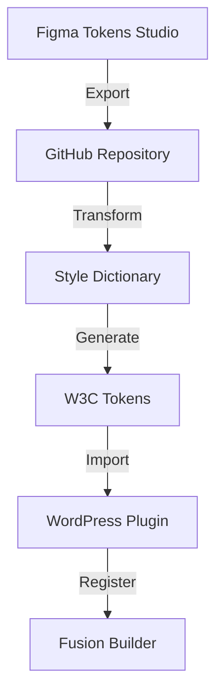
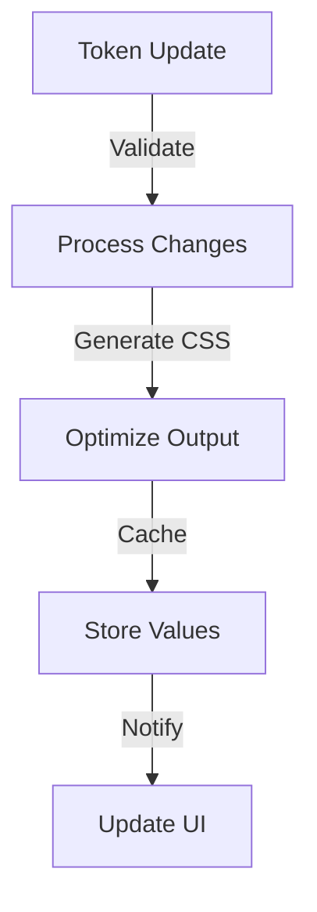

# Design Token Management System

## Overview

This document outlines the token management system that bridges Figma's Tokens Studio, Style Dictionary, and WordPress implementation.

## Token Pipeline

### 1. Token Flow



### 2. Token Structure

```json
{
  "color": {
    "primary": {
      "value": "#007AFF",
      "type": "color",
      "description": "Primary brand color"
    },
    "secondary": {
      "value": "{color.primary}",
      "type": "color",
      "description": "Secondary brand color"
    }
  },
  "typography": {
    "body": {
      "fontFamily": {
        "value": "Inter",
        "type": "fontFamily"
      },
      "fontSize": {
        "value": "16px",
        "type": "dimension"
      }
    }
  }
}
```

## Token Categories

### 1. Core Token Types

```yaml
token_types:
  color:
    - brand
    - semantic
    - component
  typography:
    - families
    - sizes
    - weights
  spacing:
    - layout
    - component
  breakpoints:
    - device
    - container
```

### 2. Component-Specific Tokens

```yaml
component_tokens:
  button:
    - background-color
    - text-color
    - padding
    - border-radius
  card:
    - background-color
    - shadow
    - spacing
```

## WordPress Integration

### 1. Token Registration

```php
class UHSDS_Token_Manager {
    protected $tokens = [];
    protected $active_theme = '';

    public function register_tokens($token_set) {
        try {
            $this->validate_tokens($token_set);
            $this->transform_tokens($token_set);
            $this->store_tokens($token_set);

            return true;
        } catch (Exception $e) {
            $this->handle_error($e);
            return false;
        }
    }

    protected function validate_tokens($tokens) {
        // Token validation logic
    }
}
```

### 2. Theme Management

```php
class UHSDS_Theme_Manager {
    public function switch_theme($theme_id) {
        try {
            $theme_tokens = $this->load_theme_tokens($theme_id);
            $this->apply_theme_tokens($theme_tokens);
            $this->update_fusion_builder();

            return true;
        } catch (Exception $e) {
            $this->handle_theme_error($e);
            return false;
        }
    }
}
```

## Token Usage

### 1. CSS Implementation

```scss
// Generated CSS Variables
:root {
  // Colors
  --uhsds-color-primary: #007aff;
  --uhsds-color-secondary: var(--uhsds-color-primary);

  // Typography
  --uhsds-font-family-body: "Inter", sans-serif;
  --uhsds-font-size-body: 16px;

  // Responsive
  --uhsds-breakpoint-mobile: 320px;
  --uhsds-breakpoint-tablet: 768px;
}

// Usage in components
.uhsds-component {
  color: var(--uhsds-color-primary);
  font-family: var(--uhsds-font-family-body);
  font-size: var(--uhsds-font-size-body);
}
```

### 2. PHP Integration

```php
class UHSDS_Token_Helper {
    public function get_token_value($token_path) {
        return $this->token_manager->get_value($token_path);
    }

    public function get_token_metadata($token_path) {
        return $this->token_manager->get_metadata($token_path);
    }
}
```

## Version Control

### 1. Token Versioning

```yaml
version_control:
  format: "semver"
  tracking:
    - token_values
    - token_metadata
    - theme_configurations
```

### 2. Change Management

```php
class UHSDS_Token_Version_Control {
    public function track_changes($token_set) {
        $changes = [
            'added' => [],
            'modified' => [],
            'removed' => []
        ];

        // Change tracking logic

        return $changes;
    }
}
```

## UI Components

### 1. Token Picker Interface

```yaml
token_picker:
  features:
    - color_preview
    - typography_preview
    - spacing_visualization
    - responsive_preview
  metadata:
    - version
    - last_updated
    - description
```

### 2. Theme Switcher

```yaml
theme_switcher:
  capabilities:
    - preview_theme
    - compare_themes
    - branch_selection
    - version_history
```

## Performance Optimization

### 1. Token Loading

- Lazy load token values
- Cache frequently used tokens
- Batch token updates
- Minimize CSS generation

### 2. Update Strategy



## Error Handling

### 1. Validation Errors

```php
try {
    $token_manager->validate_tokens($tokens);
} catch (TokenValidationException $e) {
    // Handle validation errors
    log_error($e->getMessage());
    show_admin_notice($e->getMessage());
}
```

### 2. Runtime Errors

```php
try {
    $token_manager->apply_tokens($tokens);
} catch (TokenApplicationException $e) {
    // Handle runtime errors
    log_error($e->getMessage());
    revert_to_previous_state();
    notify_admin($e->getMessage());
}
```

## Documentation Requirements

### 1. Token Documentation

- Token naming conventions
- Usage guidelines
- Theme configuration
- Migration guides
- Troubleshooting tips

### 2. Integration Documentation

- Setup instructions
- API reference
- Example implementations
- Performance guidelines
- Best practices

## IDE Token Integration

### 1. Token Autocomplete

The in-browser IDE provides intelligent token suggestions and autocomplete functionality:

```javascript
{
  "tokenCompletion": {
    "triggers": ["var(--", "${"],
    "categories": [
      "color",
      "typography",
      "spacing",
      "breakpoints"
    ],
    "contextAware": true
  }
}
```

### 2. Token Preview

- Real-time token value display on hover
- Color swatches for color tokens
- Measurement unit visualization
- Theme variation preview

### 3. Token Documentation

```javascript
{
  "tokenDocs": {
    "color.primary": {
      "description": "Primary brand color",
      "usage": "Main call-to-action elements",
      "variations": ["light", "dark"],
      "examples": [
        "Buttons",
        "Headers"
      ]
    }
  }
}
```

### 4. Theme Switching

- Live theme preview in editor
- Token value comparison across themes
- Theme-specific documentation
- Contrast validation

### 5. Token Validation

```javascript
{
  "validation": {
    "rules": {
      "color": "must use design system tokens",
      "spacing": "must use spacing scale",
      "typography": "must use type scale"
    },
    "linting": {
      "enabled": true,
      "severity": "warning"
    }
  }
}
```

---

## Design Token Agent Technical Review ("The Architect")

### Token System Architecture Concerns

1. **Token Pipeline Enhancement**

   ```mermaid
   graph TD
       A[Figma Tokens] -->|Export| B[Git Repository]
       B -->|Validate| C[Token Processor]
       C -->|Transform| D[Style Dictionary]
       D -->|Generate| E[Platform Outputs]
       E -->|Validate| F[Integration Layer]
       F -->|Register| G[WordPress/Fusion]

       H[Token Validator] -->|Check| C
       H -->|Verify| E

       I[Token Monitor] -->|Track| C
       I -->|Analyze| E

       J[Cache Layer] -.->|Optimize| F
       J -.->|Optimize| G
   ```

2. **Token Validation Framework**

   ```php
   interface TokenValidationSystem {
       // Structural validation
       public function validateTokenStructure(array $tokens): ValidationResult;

       // Semantic validation
       public function validateTokenRelationships(array $tokens): ValidationResult;

       // Integration validation
       public function validatePlatformCompatibility(array $tokens): ValidationResult;

       // Performance validation
       public function analyzeTokenUsageImpact(array $tokens): ImpactAnalysis;
   }
   ```

3. **Token Transformation Pipeline**
   ```yaml
   transformation_pipeline:
     stages:
       preprocessing:
         - token_normalization
         - relationship_resolution
         - validation_checks
       transformation:
         - style_dictionary_transform
         - custom_transforms
         - platform_specific_transforms
       postprocessing:
         - optimization
         - validation
         - documentation_generation
     monitoring:
       - performance_metrics
       - error_tracking
       - usage_analytics
   ```

### Critical Improvements Needed

1. **Token Resolution System**

   ```typescript
   interface TokenResolver {
     // Resolve token references
     resolveTokenReferences(token: Token): ResolvedToken;

     // Handle circular dependencies
     detectCircularDependencies(tokens: TokenSet): CircularRef[];

     // Validate token graph
     validateTokenGraph(tokens: TokenSet): GraphValidation;

     // Optimize resolution paths
     optimizeResolutionPaths(tokens: TokenSet): OptimizedPaths;
   }
   ```

2. **Token Cache Management**

   ```php
   class TokenCacheManager {
       // Hierarchical caching
       public function cacheTokenSet(string $scope, array $tokens): void;

       // Smart invalidation
       public function invalidateScope(string $scope): void;

       // Cache warming
       public function warmupFrequentTokens(): void;

       // Cache analytics
       public function analyzeTokenUsage(): CacheAnalytics;
   }
   ```

3. **Platform-Specific Optimizations**
   ```yaml
   platform_optimizations:
     css:
       strategies:
         - css_custom_properties
         - critical_inline_tokens
         - dynamic_token_loading
       performance:
         - minimal_specificity
         - reduced_redundancy
         - optimized_selectors
     javascript:
       strategies:
         - tree_shakeable_tokens
         - dynamic_imports
         - memoized_resolution
       performance:
         - bundle_optimization
         - runtime_performance
         - memory_usage
     php:
       strategies:
         - cached_token_values
         - lazy_token_loading
         - bulk_token_operations
       performance:
         - reduced_db_queries
         - optimized_memory_usage
         - cached_computations
   ```

### Integration Recommendations

1. **Token Synchronization**

   ```php
   interface TokenSyncSystem {
       // Platform synchronization
       public function syncPlatforms(): SyncResult;

       // Version management
       public function manageTokenVersions(): VersionStatus;

       // Conflict resolution
       public function resolveTokenConflicts(): ConflictResolution;

       // Deployment coordination
       public function coordinateDeployment(): DeploymentStatus;
   }
   ```

2. **Token Analytics System**
   ```typescript
   interface TokenAnalytics {
     // Usage tracking
     trackTokenUsage(token: Token): void;

     // Performance monitoring
     monitorTokenPerformance(): PerformanceMetrics;

     // Impact analysis
     analyzeTokenChanges(changes: TokenChanges): ChangeImpact;

     // Optimization suggestions
     suggestOptimizations(): OptimizationReport;
   }
   ```

### Next Implementation Steps

1. **Immediate Actions**

   - Implement enhanced token validation
   - Develop token resolution optimization
   - Create token monitoring system

2. **Short-term Goals**

   - Build token analytics dashboard
   - Enhance caching system
   - Improve platform-specific optimizations

3. **Long-term Vision**
   - Implement AI-assisted token suggestions
   - Develop predictive token optimization
   - Create advanced token visualization tools
