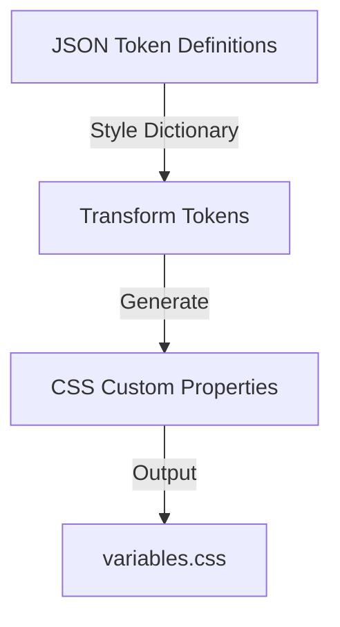

# USWDS Design System Alignment

## Overview

This document outlines how our design system aligns with and extends the U.S. Web Design System (USWDS) principles and token structure, focusing on color, typography, and spacing systems. Our implementation uses Style Dictionary to generate CSS custom properties from our token definitions.

## Color System

### Color Token Structure

```json
{
  "color": {
    "system": {
      "gray": {
        "warm": {
          "5": { "value": "#FAF9F7" },
          "10": { "value": "#F5F5F0" }
          // ... through 90
        },
        "cool": {
          "5": { "value": "#FBFCFD" },
          "10": { "value": "#F3F6F9" }
          // ... through 90
        }
      }
    },
    "theme": {
      "base": {
        "primary": { "value": "{color.system.blue.warm.60v}" },
        "secondary": { "value": "{color.system.red.60v}" },
        "accent-warm": { "value": "{color.system.orange.40v}" },
        "accent-cool": { "value": "{color.system.blue.cool.20v}" }
      },
      "background": {
        "default": { "value": "{color.system.gray.2}" },
        "dark": { "value": "{color.system.gray.90}" },
        "darker": { "value": "{color.system.gray.100}" }
      },
      "text": {
        "default": { "value": "{color.system.ink.base}" },
        "reverse": { "value": "{color.system.white.base}" },
        "disabled": { "value": "{color.system.gray.40}" }
      },
      "state": {
        "error": { "value": "{color.system.red.warm.60v}" },
        "warning": { "value": "{color.system.orange.40v}" },
        "success": { "value": "{color.system.green.cool.40v}" },
        "info": { "value": "{color.system.blue.40v}" }
      }
    }
  }
}
```

## Typography System

### Type Scale

```json
{
  "typography": {
    "scale": {
      "3xs": { "value": "12px" },
      "2xs": { "value": "13px" },
      "xs": { "value": "14px" },
      "sm": { "value": "16px" },
      "md": { "value": "17px" },
      "lg": { "value": "18px" },
      "xl": { "value": "20px" },
      "2xl": { "value": "22px" },
      "3xl": { "value": "24px" }
    },
    "family": {
      "sans": {
        "value": "'Public Sans Web', system-ui, -apple-system"
      },
      "serif": {
        "value": "'Merriweather Web', Georgia, serif"
      },
      "mono": {
        "value": "'Roboto Mono Web', monospace"
      }
    },
    "weight": {
      "normal": { "value": "400" },
      "medium": { "value": "500" },
      "semibold": { "value": "600" },
      "bold": { "value": "700" }
    }
  }
}
```

## Spacing System

### Spacing Units

```json
{
  "spacing": {
    "unit": {
      "0": { "value": "0" },
      "1px": { "value": "1px" },
      "2px": { "value": "2px" },
      "05": { "value": "4px" },
      "1": { "value": "8px" },
      "2": { "value": "16px" },
      "3": { "value": "24px" },
      "4": { "value": "32px" },
      "5": { "value": "40px" },
      "6": { "value": "48px" },
      "7": { "value": "56px" },
      "8": { "value": "64px" },
      "9": { "value": "72px" }
    },
    "component": {
      "card": {
        "padding": { "value": "{spacing.unit.3}" },
        "gap": { "value": "{spacing.unit.2}" }
      },
      "button": {
        "padding-x": { "value": "{spacing.unit.2}" },
        "padding-y": { "value": "{spacing.unit.1}" }
      }
    }
  }
}
```

### Grid System

```json
{
  "grid": {
    "settings": {
      "column-count": { "value": "12" },
      "container-max": { "value": "1200px" },
      "gap-width": { "value": "2rem" }
    },
    "breakpoint": {
      "mobile": { "value": "320px" },
      "mobile-lg": { "value": "480px" },
      "tablet": { "value": "640px" },
      "tablet-lg": { "value": "880px" },
      "desktop": { "value": "1024px" },
      "desktop-lg": { "value": "1200px" },
      "widescreen": { "value": "1400px" }
    }
  }
}
```

## Component Tokens

### Component Structure

```json
{
  "component": {
    "button": {
      "primary": {
        "background": { "value": "{color.theme.base.primary}" },
        "color": { "value": "{color.theme.text.reverse}" },
        "hover": {
          "background": { "value": "{color.theme.base.primary-dark}" }
        }
      },
      "secondary": {
        "background": { "value": "{color.theme.base.secondary}" },
        "color": { "value": "{color.theme.text.reverse}" }
      },
      "accent": {
        "background": { "value": "{color.theme.base.accent-warm}" },
        "color": { "value": "{color.theme.text.reverse}" }
      }
    },
    "card": {
      "default": {
        "background": { "value": "{color.theme.background.default}" },
        "border": { "value": "1px solid" },
        "border-color": { "value": "{color.theme.border}" },
        "radius": { "value": "{radius.md}" }
      }
    }
  }
}
```

## Style Dictionary Configuration

### Basic Configuration

```javascript
module.exports = {
  source: ["tokens/**/*.json"],
  platforms: {
    css: {
      transformGroup: "css",
      buildPath: "build/css/",
      files: [
        {
          destination: "variables.css",
          format: "css/variables",
          options: {
            selector: ":root",
          },
        },
      ],
    },
  },
};
```

### Token Transformation Process



## Accessibility Compliance

### Color Contrast Requirements

```json
{
  "accessibility": {
    "contrast": {
      "text": {
        "normal": { "value": "4.5" },
        "large": { "value": "3" }
      },
      "ui": {
        "active": { "value": "3" },
        "inactive": { "value": "2" }
      }
    },
    "color-combinations": [
      {
        "background": "{color.theme.background.default}",
        "text": "{color.theme.text.default}",
        "required-contrast": "4.5"
      }
    ]
  }
}
```

## Migration Guidelines

### Token Migration Steps

1. Audit existing tokens
2. Map to USWDS equivalents
3. Create Style Dictionary token files
4. Validate token mappings
5. Generate CSS variables
6. Update components to use new variables
7. Test accessibility
8. Document changes

### Component Updates Process

1. Identify USWDS equivalent patterns
2. Update CSS variable references
3. Test functionality
4. Validate accessibility
5. Update documentation
