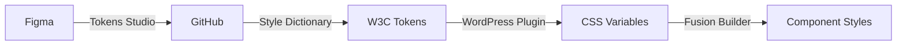
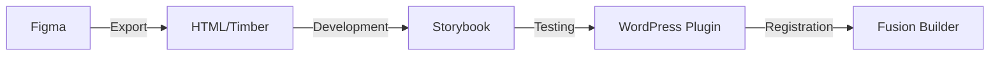
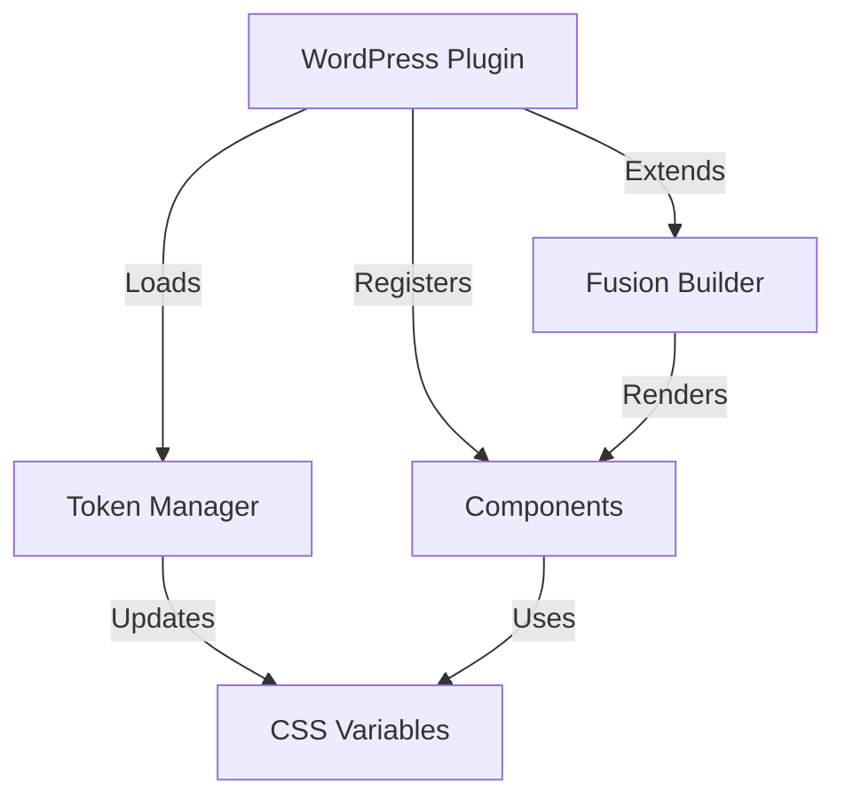

# Technical Workflow Documentation

## System Workflows

### 1. Design Token Pipeline



#### Process Details

1. **Figma to GitHub**

   - Tokens Studio plugin exports tokens
   - JSON format stored in GitHub
   - Version control maintained

2. **Token Transformation**

   - Style Dictionary v4 processes tokens
   - Converts to W3C-compliant format
   - Generates CSS variables

3. **WordPress Integration**
   - Plugin loads CSS variables
   - Variables available to components
   - Real-time updates possible

### 2. Component Development Pipeline



#### Process Details

1. **Component Design**

   - Figma component creation
   - Export to HTML/Timber format
   - Initial styling applied

2. **Development Environment**

   - Storybook setup
   - Component testing
   - Style verification

3. **WordPress Integration**
   - Component registration
   - Fusion Builder adaptation
   - WYSIWYG controls

### 3. Plugin Architecture



## Implementation Details

### 1. Token Management

```php
// Token loading and processing
class TokenManager {
    // Methods for token handling
}

// Token registration with WordPress
class TokenRegistration {
    // Methods for WordPress integration
}
```

### 2. Component System

```php
// Base component class
class ComponentBase {
    // Common component functionality
}

// Fusion Builder integration
class FusionBuilderComponent {
    // Fusion Builder specific methods
}
```

### 3. Plugin Structure

```
plugin-root/
├── includes/
│   ├── token-manager/
│   ├── components/
│   └── fusion-builder/
├── templates/
│   └── components/
├── assets/
│   ├── css/
│   └── js/
└── tests/
```

## Integration Points

### 1. Figma Integration

- Tokens Studio configuration
- Component export settings
- Version control hooks

### 2. GitHub Integration

- Repository structure
- Webhook configuration
- Action workflows

### 3. WordPress Integration

- Plugin activation hooks
- Fusion Builder hooks
- Asset loading

### 4. Fusion Builder Integration

- Component registration
- Element options
- Render methods

## Development Guidelines

### 1. Token Standards

- Follow W3C token format
- Maintain backward compatibility
- Document token usage

### 2. Component Development

- Use Timber when possible
- Implement responsive design
- Follow WordPress coding standards

### 3. Testing Requirements

- Unit tests for token processing
- Component rendering tests
- Integration tests with Fusion Builder

### 4. Performance Considerations

- Optimize token loading
- Minimize CSS generation
- Cache component renders

## Deployment Workflow

### 1. Development

- Local environment setup
- Token synchronization
- Component testing

### 2. Staging

- Token validation
- Component verification
- Integration testing

### 3. Production

- Version tagging
- Asset compilation
- Cache management
