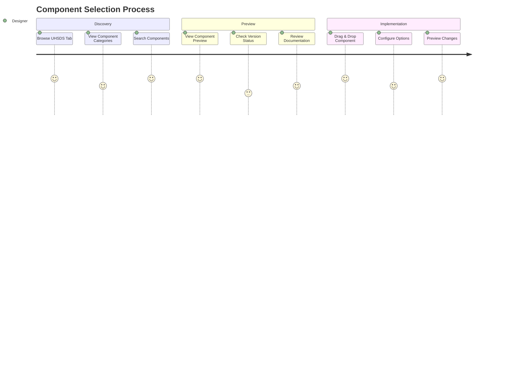
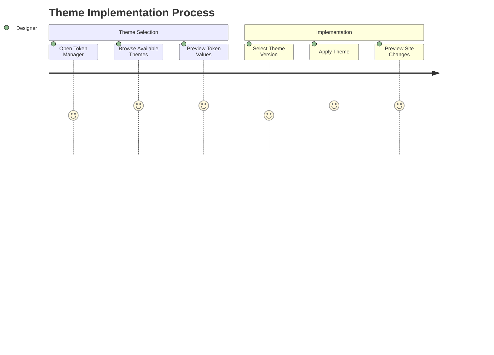
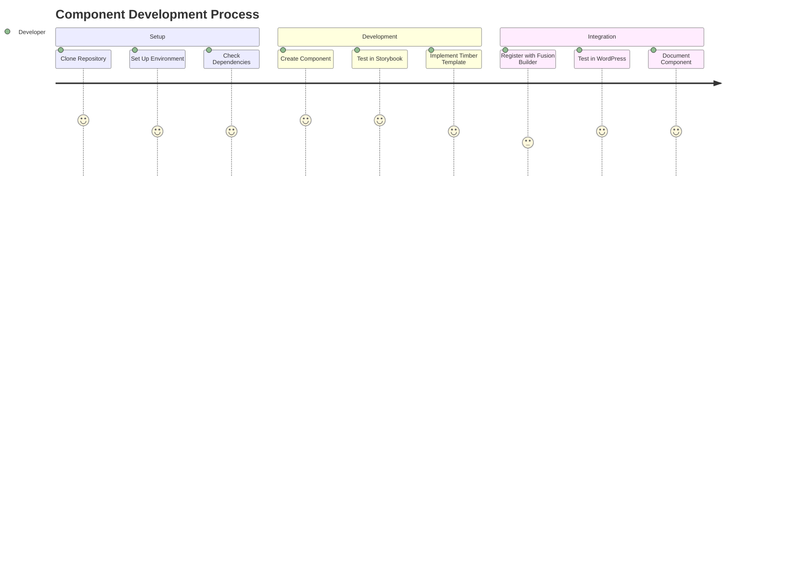
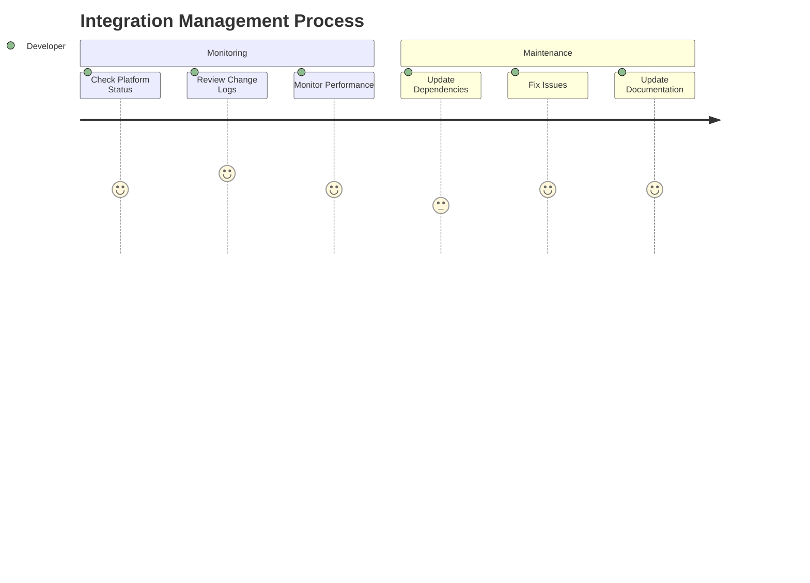
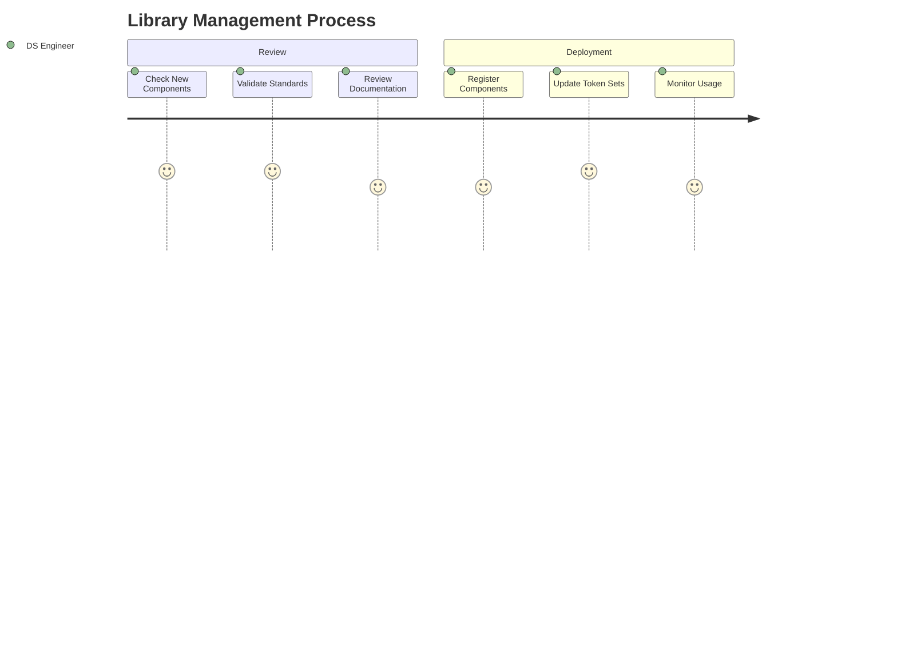

# User Journey Maps

## WordPress Designer Journey

### 1. Component Discovery and Selection

### 2. Theme Token Management

## Developer Journey

### 1. Component Development Workflow

### 2. Integration Monitoring

## Design Systems Engineer Journey

### 1. System Management

### 2. Component Library Management

## Key Interaction Points

### WordPress Admin Interface

1. **Component Browser**

   - UHSDS dedicated tab
   - Visual component preview
   - Version status indicators
   - Search and filter options

2. **Theme Manager**

   - Visual theme selector
   - Token value preview
   - Branch selection (main/dev)
   - Real-time preview

3. **Component Editor**
   - WYSIWYG interface
   - Token picker
   - Responsive preview
   - Documentation access

### Developer Tools

1. **Development Dashboard**

   - Git integration status
   - Component sync status
   - Error reporting
   - Performance metrics

2. **Component Workspace**
   - Local development environment
   - Storybook integration
   - Testing framework
   - Documentation generator

### Design Systems Tools

1. **System Dashboard**

   - System health overview
   - Token management
   - Component library status
   - Usage analytics

2. **Integration Manager**
   - Platform sync status
   - Version control
   - Documentation management
   - Analytics reporting
